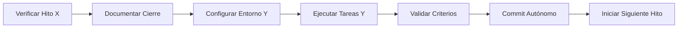

## Estructura del Patrón (Template Universal)
### PARA AVANZAR DEL HITO [X] AL HITO [Y]:
**CIERRE DEL HITO ACTUAL ([X]):**
- Verifique que **todas las pruebas definidas para [X]** hayan sido ejecutadas y aprobadas
- Confirme el cumplimiento **total** de sus criterios de aceptación
- Actualice [ESTADO_PROYECTO.md](cci:7://file:///c:/Users/harva/Documents/Trabajos/meetgar/FluxCoreChat/FluxCoreChat/docs/ESTADO_PROYECTO.md:0:0-0:0) con:
  ```markdown
  ### [X] - FECHA_CIERRE
  ✅ Pruebas completadas: [N]/[N]
  ✅ Errores resueltos: [lista_ids]
  ✅ Documentación actualizada
  ```

**INICIO DEL NUEVO HITO ([Y]):**
1. Una vez validado [X], proceda a ejecutar **las tareas específicas del Hito [Y]**
2. Genere entorno de pruebas específico para [Y]:
   ```bash
   bun run test:hito_[Y] --env=testing
   ```

**CRITERIOS DE FINALIZACIÓN PARA [Y]:**
El hito se considerará completado cuando se cumpla **AL MENOS**:
- ✅ Implementación Funcional: Código/feature completo
- ✅ Pruebas Exitosas: Unitarias, integración y funcionales aprobadas
- ✅ Errores Resueltos: Issues cerrados (referenciar IDs)
- ✅ Documentación Actualizada: 
- ✅ Guía de Verificación: Lista numerada para pruebas manuales (si aplica)
- ✅ Limpieza de Contexto: 

---

## Protocolo Post-Hito
Al finalizar un hito, la IA DEBE:
1. ✅ Evaluar y decidir autónomamente el siguiente hito según:
2. ✅ Commitear cambios con mensaje estructurado:
3. ✅ Inmediatamente comenzar ejecución del siguiente hito usando HTP

---

## Información para Hito WhatsApp Adapter
### Configuración Webhook Meta (Oficial):
```bash
# 1. Registrar aplicación en Meta Developers
curl -X POST https://graph.facebook.com/v19.0/APP_ID/subscriptions \
  -d "access_token=TOKEN" \
  -d "object=whatsapp_business_account" \
  -d "callback_url=https://yourdomain.com/webhook" \
  -d "fields=message_template_status_update,messages"

# 2. Configurar token de verificación
VERIFICATION_TOKEN="fluxcore_$(date +%s | sha256sum | base64 | head -c 16)"
```

### Enviar mensajes (API Oficial):
Si es necesario hacerlo desde el entorno de Meta, proporcionar información para hacerlo. 
```bash
curl -i -X POST \
  https://graph.facebook.com/v22.0/{{Phone-Number-ID}}/messages \
  -H "Authorization: Bearer {{Token}}" \
  -H "Content-Type: application/json" \
  -d '{
    "messaging_product": "whatsapp",
    "to": "{{Recipient-Phone-Number}}",
    "type": "template",
    "template": {
      "name": "hello_world",
      "language": { "code": "en_US" }
    }
  }'
```

### Configuración Adapter FluxCore:

**Siguiente acción:**  
Ejecutar inmediatamente HTP para transición entre hitos actual→siguiente
