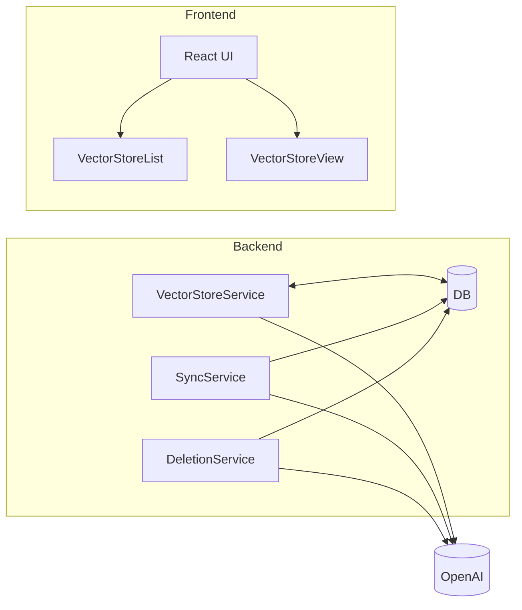

# VS-ALIGN: Alineación de Vector Stores con OpenAI

## Investigación y Enfoque Arquitectónico

### Problema
- Orphaned files en OpenAI
- Políticas de expiración inconsistentes
- Falta de sincronización robusta
- UI no refleja colección real de archivos

### Solución
1. **Espejo Estricto**: OpenAI vector stores son caché de solo lectura localmente
2. **Distinción de Origen**: Columna `source` en DB (`primary` para local, `cache` para OpenAI)
3. **Eliminación en Cascada**: Al borrar un store, se borran sus archivos asociados (local y OpenAI)
4. **Sincronización Cron**: Actualización periódica del estado desde OpenAI
5. **Conversión de Políticas**: Utilidades para traducir políticas de expiración
6. **UI**: Badges y filtros para distinguir tipos

### Arquitectura


## Hitos y Muestras de Código

### Hito 1: Migración de Esquema DB
- Script: `packages/db/migrations/0008_vector_store_source.ts`
```typescript
// Añadir columna source
await db.run(sql`
  ALTER TABLE fluxcore_vector_stores
  ADD COLUMN source VARCHAR(10) NOT NULL DEFAULT 'primary';
`);

// Actualizar registros existentes
await db.run(sql`
  UPDATE fluxcore_vector_stores
  SET source = 'cache'
  WHERE backend = 'openai';
`);
```

### Hito 2: Backend - Servicio de Vector Stores
- Archivo: `apps/api/src/services/fluxcore/vector-store.service.ts`
```typescript
export async function updateVectorStore(id: string, accountId: string, data: Partial<NewFluxcoreVectorStore>) {
  // ...
  if (existing.source === 'cache') {
    throw new Error('Cannot update a vector store that is a cache of an external source');
  }
  // ...
}
```

### Hito 3: Frontend - Listado de Vector Stores
- Componente: `apps/web/src/components/fluxcore/VectorStoreList.tsx`
```tsx
<Badge variant={store.source === 'cache' ? 'secondary' : 'default'}>
  {store.source === 'cache' ? 'OpenAI Mirror' : 'Local'}
</Badge>
```

### Hito 4: Sincronización Cron
- Servicio: `apps/api/src/services/vector-store-sync.service.ts`
```typescript
async function syncOpenAIStores() {
  const stores = await db.select().from(fluxcoreVectorStores).where(eq(fluxcoreVectorStores.source, 'cache'));
  for (const store of stores) {
    await syncStore(store);
  }
}
```

## Conclusión
La implementación cumple con los requisitos de alineación, garantizando coherencia entre los stores locales y OpenAI.
