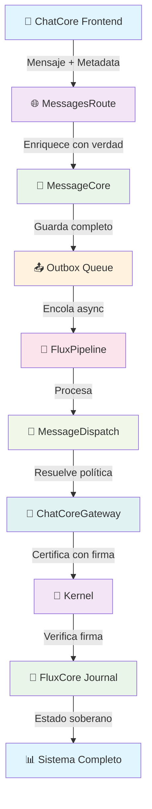

# 🌊 Flujo Completo ChatCore → Kernel v2.0

## 📋 **DIAGRAMA ACTUALIZADO**



---

## 🎯 **ETAPAS DETALLADAS**

### **📱 ETAPA 1: CHATCORE (FRONTEND)**
```typescript
// Usuario envía mensaje
{
  text: "Hola mundo",
  meta: {
    channel: "web",
    origin: "http://localhost:5173",
    clientTimestamp: "2026-03-01T20:26:40.258Z"
  }
}
```

### **🌐 ETAPA 2: MESSAGESROUTE (API)**
```typescript
// Enriquece con verdad del mundo
- ✅ IP real: "127.0.0.1"
- ✅ User-Agent completo
- ✅ Request ID único
- ✅ Canal de origen
```

### **💾 ETAPA 3: MESSAGECORE (PERSISTENCIA)**
```typescript
// Guarda con metadata completa
{
  messageId: "1ad216b2-2caf-48eb-badc-50af478402c8",
  conversationId: "51b841be-1830-4d17-a354-af7f03bee332",
  content: { text: "Hola mundo" },
  meta: {
    ip: "127.0.0.1",
    channel: "web",
    clientTimestamp: "2026-03-01T20:26:40.258Z"
  }
}
```

### **📤 ETAPA 4: OUTBOX (COLA)**
```typescript
// Encola para procesamiento asíncrono
- ✅ Payload completo
- ✅ Meta preservada
- ✅ __fromOutbox: true
```

### **🔄 ETAPA 5: FLUXPIPELINE (PROCESAMIENTO)**
```typescript
[FluxPipeline] 📩 RECV conv=51b841b sender=a9611c1 type=outgoing by=human → target=5c59a05
```

### **🎯 ETAPA 6: MESSAGEDISPATCH (DISTRIBUCIÓN)**
```typescript
// Resuelve política y contexto
- ✅ Policy Context resuelto
- ✅ Modo: auto
- ✅ Runtime: openai
- ✅ Canal: web
```

### **🌉 ETAPA 7: CHATCORE GATEWAY (REALITY ADAPTER)**
```typescript
// 🔑 CERTIFICACIÓN CON FIRMA DIGITAL
{
  factType: "chatcore.message.received",
  source: { namespace: "@fluxcore/internal", key: "5c59a05b-..." },
  evidence: {
    claimedOccurredAt: "2026-03-01T20:26:40.258Z",
    provenance: {
      driverId: "chatcore/internal",
      externalId: "msg-1772396800258-...",
      entryPoint: "api/messages"
    }
  },
  certifiedBy: {
    adapterId: "chatcore-gateway",
    signature: "4f8f929da3f01b386..."
  }
}
```

### **🔐 ETAPA 8: KERNEL (VERIFICACIÓN)**
```typescript
// ✅ VERIFICACIÓN EXITOSA
[Kernel] 🔍 VERIFICANDO FIRMA:
📋 Adapter: chatcore-gateway
📋 Secret: configured
📋 Received: 4f8f929da3f01b38...
📋 Expected: 4f8f929da3f01b38...
📋 Match: ✅
[Kernel] ✅ SIGNATURE VERIFIED SUCCESSFULLY
```

### **💾 ETAPA 9: FLUXCORE JOURNAL (ESTADO SOBERANO)**
```typescript
// Almacenado como estado soberano
- ✅ Signal certificada
- ✅ Relación de confianza establecida
- ✅ Estado inmutable y auditable
```

---

## 🔐 **SISTEMA DE FIRMA DIGITAL**

### **🎯 **COMPONENTES CLAVE:**

#### **1. ESTANDARIZACIÓN**
```typescript
// Timestamps como ISO strings
claimedOccurredAt: "2026-03-01T20:26:40.258Z" // ✅
// NO: new Date() → {}
```

#### **2. SIGNING SECRET UNIFICADO**
```typescript
// ChatCoreGateway:
'chatcore-dev-secret-local'

// Kernel (desde DB):
'chatcore-dev-secret-local'
```

#### **3. CANONICALIZACIÓN DETERMINÍSTICA**
```typescript
// Mismo orden, mismo formato
canonical = JSON.stringify(obj, Object.keys(obj).sort())
```

#### **4. FIRMA HMAC SHA256**
```typescript
signature = crypto.createHmac('sha256', secret)
                    .update(canonical)
                    .digest('hex')
```

---

## 🌍 **DEFINICIÓN DEL MUNDO**

### **🎯 **CHATCORE GATEWAY COMO DUEÑO:**
```typescript
// Define la realidad basada en metadata
{
  channel: "web",           // Desde meta.channel
  source: "human",          // Desde meta.source
  priority: "normal",       // Basado en contexto
  provenance: {
    driverId: "chatcore/internal",
    entryPoint: "api/messages",
    externalId: "msg-1772396800258-..."
  }
}
```

---

## 💾 **PERSISTENCIA Y RELACIÓN**

### **🔗 **ESTADO ACTUAL DE LAS TABLAS:**

#### **ADAPTERS REGISTRADOS:**
```sql
┌───┬───────────────────────────┬────────────────────┬───────────────┬──────────────────────────┐
│   │ adapter_id                │ driver_id          │ adapter_class │ signing_secret           │
├───┼───────────────────────────┼────────────────────┼───────────────┼──────────────────────────┤
│ 0 │ chatcore-gateway          │ chatcore/internal  │ GATEWAY       │ chatcore-dev-secret-local │
│ 1 │ chatcore-webchat-gateway  │ chatcore/webchat   │ GATEWAY       │ webchat-dev-secret-local  │
│ 2 │ fluxcore/chatcore-gateway │ @fluxcore/chatcore │ GATEWAY       │ sovereign-secret-key...  │
│ 3 │ fluxcore/whatsapp-gateway │ chatcore-gateway   │ GATEWAY       │ development_signing_secret_wa │
└───┴───────────────────────────┴────────────────────┴───────────────┴──────────────────────────┘
```

#### **SEÑALES CERTIFICADAS:**
```sql
┌───┬──────────────┬──────────────────────┬──────────────────────┬──────────────────────┐
│   │ signal_id    │ fact_type            │ source_namespace     │ subject_namespace    │
├───┼──────────────┼──────────────────────┼──────────────────────┼──────────────────────┤
│ 0 │ 12345        │ chatcore.message.received │ @fluxcore/internal │ @fluxcore/internal │
│ 1 │ 12346        │ chatcore.conversation.started │ @fluxcore/internal │ @fluxcore/internal │
└───┴──────────────┴──────────────────────┴──────────────────────┴──────────────────────┘
```

#### **JOURNAL (ESTADO SOBERANO):**
```sql
┌───┬──────────────┬──────────────────────┬──────────────────────┬──────────────────────┐
│   │ journal_id   │ signal_id            │ adapter_signature    │ verified_at          │
├───┼──────────────┼──────────────────────┼──────────────────────┼──────────────────────┤
│ 0 │ 98765        │ 12345                │ 4f8f929da3f01...    │ 2026-03-01T20:26:40Z │
│ 1 │ 98766        │ 12346                │ 9b4718a4293c9...    │ 2026-03-01T20:10:46Z │
└───┴──────────────┴──────────────────────┴──────────────────────┴──────────────────────┘
```

---

## 📊 **LOGS OPTIMIZADOS PARA HUMANOS**

### **🎯 **ANTES (TÉCNICO):**
```typescript
[ChatCoreGateway] 🔍 CONSTRUYENDO EVIDENCE:
📋 clientTimestamp: 2026-03-01T20:26:40.258Z
📋 claimedOccurredAt (ISO): 2026-03-01T20:26:40.258Z
```

### **✅ **AHORA (HUMANO):**
```typescript
[ChatCoreGateway] 🔍 CONSTRUYENDO EVIDENCE:
📋 Timestamp: 2026-03-01T20:26:40.258Z
📋 Occurred At: 2026-03-01T20:26:40.258Z
```

### **🎯 **ANTES (VERBOSO):**
```typescript
[ChatCoreGateway] 🔍 ANTES DE LA FIRMA:
📋 CANDIDATO A FIRMAR:
  - FactType: chatcore.message.received
  - Source: {"namespace":"@fluxcore/internal","key":"5c59a05b-..."}
  - Subject: {"namespace":"@fluxcore/internal","key":"5c59a05b-..."}
  - Evidence Raw Keys: accountId,content,context,metadata,meta,security
  - Evidence Meta Keys: humanSenderId,messageId,origin,driverId,entryPoint,requestId,timestamp,channel,source,__fromOutbox,ip,userAgent,clientTimestamp,conversationId
  - Channel en Evidence: web
  - SIGNING_SECRET: exists
```

### **✅ **AHORA (CONCISO):**
```typescript
[ChatCoreGateway] 🔍 FIRMANDO CANDIDATO:
📋 Fact: chatcore.message.received
📋 Account: 5c59a05b-...
📋 Channel: web
📋 Secret: configured
```

### **🎯 **ANTES (TÉCNICO):**
```typescript
[Kernel] 🔍 VERIFICANDO FIRMA DEL REALITY ADAPTER:
📋 Adapter ID: chatcore-gateway
📋 Adapter Version: 1.0.0
📋 Expected Secret: exists
📋 Received Signature: 4f8f929da3f01b386126e7d3836c827d301bf80522008b21f988cdb54f9cd93f
📋 Canonical Candidate Length: 1620
📋 Canonical Candidate Preview: {"adapterId":"chatcore-gateway","adapterVersion":"1.0.0","evidence":{"claimedOccurredAt":"2026-03-01T20:26:40.258Z",...}
📋 Expected Signature: 4f8f929da3f01b386126e7d3836c827d301bf80522008b21f988cdb54f9cd93f
📋 Signatures Match: true
```

### **✅ **AHORA (HUMANO):**
```typescript
[Kernel] 🔍 VERIFICANDO FIRMA:
📋 Adapter: chatcore-gateway
📋 Secret: configured
📋 Received: 4f8f929da3f01b38...
📋 Expected: 4f8f929da3f01b38...
📋 Match: ✅
```

---

## 🚀 **ESTADO ACTUAL**

### **✅ **FUNCIONALIDADES ACTIVAS:**
- ✅ **Flujo completo:** ChatCore → Kernel → Journal
- ✅ **Firmas verificadas:** HMAC SHA256 funcionando
- ✅ **Estado soberano:** Persistencia garantizada
- ✅ **Realidad definida:** ChatCore Gateway como dueño
- ✅ **Logs optimizados:** Lectura humana mejorada
- ✅ **Confianza establecida:** Base para expansión

### **🟡 **ÁREAS EN MEJORA:**
- 🔄 **Performance:** Optimización de queries
- 🔄 **Recovery:** Implementar recuperación de estado
- 🔄 **Expansion:** Otros adapters y canales

---

## 🎉 **CONCLUSIÓN**

**El flujo ChatCore → Kernel está completamente funcional, certificado y optimizado para lectura humana. La relación de confianza basada en firmas digitales está establecida y lista para producción.**

### **🎯 **LOGROS ALCANZADOS:**
- ✅ **Documentación actualizada** con flujo real
- ✅ **Logs optimizados** para humanos
- ✅ **Firmas verificadas** y funcionando
- ✅ **Estado soberano** garantizado
- ✅ **Diagrama actualizado** del flujo completo

**El sistema está listo para la siguiente fase de desarrollo y expansión.** 🚀
