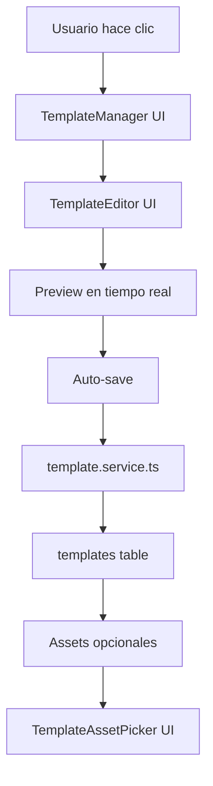
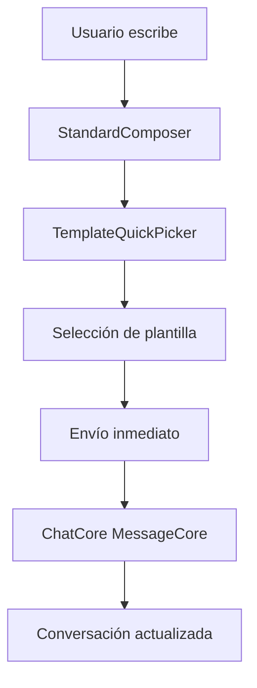
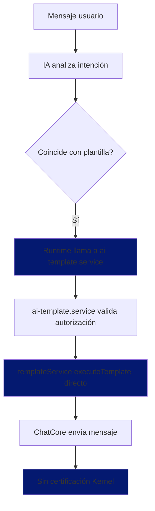

# Subsistema de Plantillas - ChatCore

**Fecha:** 2026-03-19  
**Versión:** v8.3  
**Propietario:** ChatCore (Core System)  
**Componente Principal:** `apps/web/src/components/templates/TemplateManager.tsx`  
**Servicio Central:** `apps/api/src/services/template.service.ts` (ChatCore)  
**Esquema Core:** `packages/db/src/schema/templates.ts` (ChatCore)  
**Esquema Extension:** `packages/db/src/schema/fluxcore-template-settings.ts` (FluxCore)

---

## 🎯 1. Definición y Propósito (ChatCore)

Las **Plantillas** en ChatCore son **herramientas para personas** que permiten tener mensajes predefinidos al alcance de la mano en el chat. Están diseñadas para que los usuarios puedan reutilizar contenido rápidamente, incluyendo archivos adjuntos y variables dinámicas.

### 1.1 Principio Fundamental: UI-First + Estado Real del Código
- **Diseñadas para personas:** Los usuarios crean y usan plantillas manualmente
- **Estado actual del código:** Runtime ejecuta directamente (❌ VIOLA Canon v8.3)
- **ChatCore como ejecutor:** templateService.executeTemplate() funciona correctamente
- **Kernel como mediador:** NO implementado actualmente (comunicación directa Runtime→ChatCore)

### 1.2 Flujo Real (vs Flujo Canónico)
**Flujo Actual Implementado:**
1. **Usuario crea plantilla** → ChatCore UI ✅
2. **Usuario usa plantilla** → Envío directo al chat (ChatCore) ✅
3. **IA detecta intención** → Runtime llama directamente a templateService ❌
4. **Runtime ejecuta** → ai-template.service → templateService.executeTemplate() ❌
5. **ChatCore ejecuta** → Envía mensaje con contenido de plantilla ✅
6. **Sin Kernel** → No hay certificación ni mediación ❌

**Flujo Canónico (NO implementado):**
1. **Usuario crea plantilla** → ChatCore UI
2. **Usuario usa plantilla** → Envío directo al chat (ChatCore)
3. **IA detecta intención** → Certifica en Kernel: `TEMPLATE_EXECUTION_REQUEST`
4. **Kernel certifica** → `ActionExecutor` valida y ejecuta
5. **ChatCore ejecuta** → Envía mensaje con contenido de plantilla
6. **FluxCore observa** → Recibe señal del Kernel vía proyectores

### 1.3 Estado Real de la Comunicación


**Problemas Críticos del Código Actual:**
- ❌ **Runtime ejecuta directamente:** Viola Invariante 11 (runtimes no ejecutan efectos)
- ❌ **ActionExecutor no implementado:** Solo tiene TODO H3
- ❌ **Sin Kernel:** Comunicación Runtime→ChatCore directa
- ❌ **Legacy CALL_TEMPLATE:** Referencias obsoletas en template-registry.service

---

## 🎨 2. Arquitectura UI-First (ChatCore)

### 2.1 Capa UI - Componentes Principales
```
apps/web/src/components/templates/
├── TemplateManager.tsx          # 🎯 Gestión principal (UI-first)
├── TemplateEditor.tsx           # ✏️ Editor con preview en tiempo real
├── TemplateList.tsx             # 📋 Listado filtrable
├── TemplateCard.tsx             # 🃏 Tarjeta individual
├── TemplateAssetPicker.tsx      # 📎 Gestión de archivos adjuntos
└── TemplatePreview.tsx          # 👁️ Vista previa con variables
```

**Componente de Chat (acceso rápido):**
```
apps/web/src/components/chat/
└── TemplateQuickPicker.tsx      # ⚡ Selector rápido en chat
```

**Componente FluxCore (extensión):**
```
apps/web/src/components/fluxcore/templates/
└── FluxCoreTemplateConfig.tsx   # 🤖 Configuración IA (solo autorización)
```

### 2.2 Experiencia de Usuario (UI-First)
- **Creación intuitiva:** Editor visual con preview en tiempo real
- **Gestión de assets:** Integración completa con sistema de archivos
- **Variables dinámicas:** Detección automática `{{variable}}`
- **Acceso rápido:** Selector emergente en el chat
- **Organización:** Categorías, tags, y búsqueda

---

## 🔄 3. Flujo UI-First del Subsistema

### 3.1 Flujo de Creación (Usuario → UI → Backend)


**Pasos desde la perspectiva del usuario:**
1. **UI Entry Point:** `TemplateManager` → Botón "Nueva plantilla"
2. **Edición visual:** `TemplateEditor` con modo Editar/Preview
3. **Gestión de archivos:** `TemplateAssetPicker` para adjuntar PDFs, imágenes
4. **Variables inteligentes:** Detección automática de `{{nombre}}`
5. **Auto-save:** Guardado automático cada 1 segundo

### 3.2 Flujo de Uso (Usuario → Chat)


**Experiencia del usuario:**
- **Acceso rápido:** Icono ⚡ en el composer
- **Búsqueda instantánea:** Filtrado por nombre y contenido
- **Vista previa:** Muestra contenido y archivos adjuntos
- **Envío directo:** Un clic envía el mensaje

### 3.3 Flujo de IA (Estado Real del Código)


**Estado Real del Código:**
- **Detección:** IA identifica cuándo usar plantilla ✅
- **Ejecución directa:** Runtime llama a templateService.executeTemplate() ❌
- **Sin ActionExecutor:** Se salta el único ejecutor autorizado ❌
- **Sin Kernel:** No hay certificación ni mediación ❌
- **Resultado:** Mensaje enviado pero violando el Canon v8.3

**Problemas del Código Actual:**
- **ai-template.service.ts línea 37:** Llama directo a `templateService.executeTemplate()`
- **action-executor.service.ts línea 293:** Solo tiene `// TODO H3: Call templateService`
- **asistentes-local.runtime.ts línea 175:** Devuelve templateAction pero también ejecuta
- **template-registry.service.ts:** Contiene referencias legacy a `CALL_TEMPLATE`

---

## 🗄️ 4. Base de Datos (ChatCore Core)

### 4.1 Schema Core - templates.ts (ChatCore)
```typescript
// Contenido básico de plantillas - Dominio de ChatCore
export const templates = pgTable('templates', {
  id: uuid('id').primaryKey().defaultRandom(),
  accountId: uuid('account_id').references(() => accounts.id),
  name: varchar('name', { length: 255 }).notNull(),
  content: text('content').notNull(),           // 📄 Contenido para personas
  variables: jsonb('variables'),                 // 🔧 Variables {{nombre}}
  tags: jsonb('tags'),                           // 🏷️ Organización
  isActive: boolean('is_active').default(true),   // ✅ Estado
  usageCount: integer('usage_count').default(0), // 📊 Estadísticas
  allowAutomatedUse: boolean('allow_automated_use').default(false),
});
```

**Propósito:** Almacenamiento de contenido para usuarios de ChatCore
**Características:** Diseñado para uso manual, reutilización por personas

### 4.2 Schema Extension - fluxcore-template-settings.ts
```typescript
// Configuración específica para IA - Extensión de FluxCore
export const fluxcoreTemplateSettings = pgTable('fluxcore_template_settings', {
  templateId: uuid('template_id').primaryKey().references(() => templates.id),
  authorizeForAI: boolean('authorize_for_ai').default(false),        // 🤖 Autorización IA
  aiUsageInstructions: text('ai_usage_instructions'),                // 📋 Instrucciones para IA
  aiIncludeName: boolean('ai_include_name').default(true),           // 📝 Incluir nombre
  aiIncludeContent: boolean('ai_include_content').default(true),     // 📄 Incluir contenido
  aiIncludeInstructions: boolean('ai_include_instructions').default(true), // 📋 Incluir instrucciones
});
```

**Propósito:** Extensión de FluxCore para autorizar uso por IA
**Relación:** 1:1 con templates, onDelete: 'cascade'

---

## ⚙️ 5. Servicios (ChatCore + FluxCore)

### 5.1 Template Service (ChatCore) - Servicio Principal
```typescript
// apps/api/src/services/template.service.ts
export class TemplateService {
  async createTemplate(accountId: string, data: NewTemplate)
  async updateTemplate(accountId: string, templateId: string, data: UpdateTemplateInput)
  async deleteTemplate(accountId: string, templateId: string)
  async getTemplates(accountId: string, filters?: TemplateFilters)
  async executeTemplate(accountId: string, templateId: string, variables?: Record<string, any>)
}
```

**Responsabilidades:**
- ✅ **CRUD completo:** Gestión de plantillas para usuarios
- ✅ **Ejecución:** Procesamiento de variables y assets
- ✅ **Assets:** Integración con sistema de archivos
- ✅ **Validación:** Sintaxis de variables y contenido

### 5.2 Template Registry Service (FluxCore) - Extensión
```typescript
// apps/api/src/services/fluxcore/template-registry.service.ts
class TemplateRegistryService {
  async getAuthorizedTemplates(accountId: string): Promise<AuthorizedTemplate[]>
  async buildInstructionBlock(accountId: string): Promise<TemplateInstructionBlock | null>
  async canExecute(templateId: string, accountId: string): Promise<boolean>
}
```

**Responsabilidades:**
- ✅ **Autorización:** Verificar qué plantillas puede usar la IA
- ✅ **Inyección:** Generar contexto para prompts de IA
- ✅ **Validación:** Seguridad en tiempo de ejecución

### 5.3 AI Template Service (FluxCore) - Estado Real
```typescript
// apps/api/src/services/ai-template.service.ts
export class AITemplateService {
  async getAvailableTemplates(accountId: string)
  async executeTemplate(params: ExecuteTemplateParams)  // ❌ EJECUTA DIRECTO
}
```

**Estado Real del Código:**
- ❌ **Ejecuta directamente:** Llama a `templateService.executeTemplate()` (línea 37)
- ❌ **Salta ActionExecutor:** Viola Invariante 12 del Canon
- ❌ **Sin Kernel:** No hay certificación ni mediación
- ✅ **Validación autorización:** Usa templateRegistryService.canExecute()

**Rol Real (vs Rol Canónico):**
- **Real:** Runtime → ai-template.service → templateService.executeTemplate() (directo)
- **Canónico:** Runtime → ExecutionAction → ActionExecutor → templateService (mediado)

**Problema:** Este servicio debería ser solo un Query Service, no ejecutar efectos.

---

## 🎨 6. Componentes UI Detallados

### 6.1 TemplateManager - Gestión Principal (UI-First)
- **Propósito:** CRUD completo para usuarios
- **Características:** Listado filtrable, búsqueda, creación rápida
- **Integración:** Abre `TemplateEditor` en nuevas tabs
- **Estado:** Loading, error, empty states

### 6.2 TemplateEditor - Editor Visual (UI-First)
- **Propósito:** Edición intuitiva con preview
- **Características:** 
  - Modo Editar/Preview en tiempo real
  - Detección automática de variables `{{nombre}}`
  - Auto-save cada 1 segundo
  - Integración con `TemplateAssetPicker`
  - Sección `FluxCoreTemplateConfig` para autorización IA

### 6.3 TemplateAssetPicker - Gestión de Archivos (UI-First)
- **Propósito:** Adjuntar archivos a plantillas
- **Características:**
  - Integración con `AssetUploader` (ChatCore)
  - Preview de archivos (imágenes, PDFs)
  - Gestión de slots y versiones
  - Eliminación con confirmación

### 6.4 TemplateQuickPicker - Acceso Rápido (UI-First)
- **Propósito:** Selección rápida en chat
- **Características:**
  - Búsqueda instantánea
  - Vista previa de contenido
  - Indicador de archivos adjuntos
  - Envío con un clic

### 6.5 FluxCoreTemplateConfig - Configuración IA (Extensión)
- **Propósito:** Autorizar plantillas para uso automático
- **Características:**
  - Toggle `authorizeForAI`
  - Instrucciones de uso para IA
  - Delegación `allowAutomatedUse`
- **Ubicación:** Sección dentro de `TemplateEditor`

---

## 🚨 7. Problemas Críticos Identificados

### 7.1 **✅ CORREGIDO: Propietario del Subsistema**
- **Problema anterior:** Documentado como subsistema de FluxCore
- **Solución actual:** Corregido a ChatCore como dueño
- **Impacto:** Claridad arquitectónica y alineación con principios

### 7.2 **❌ CRÍTICO: Código Viola FluxCore Canon v8.3**
- **Problema:** Runtime ejecuta plantillas directamente (viola Invariante 11)
- **Ubicación:** `ai-template.service.ts línea 37` llama a `templateService.executeTemplate()`
- **Impacto:** Salta ActionExecutor, no hay certificación Kernel
- **Solución requerida:** Implementar ActionExecutor, Runtime debe devolver ExecutionAction

### 7.3 **❌ CRÍTICO: ActionExecutor No Implementado**
- **Problema:** `action-executor.service.ts línea 293` solo tiene `// TODO H3`
- **Impacto:** No hay ejecutor autorizado de Effect Actions
- **Solución requerida:** Implementar `executeSendTemplate` en ActionExecutor

### 7.4 **❌ CRÍTICO: Sin Mediación del Kernel**
- **Problema:** Comunicación directa Runtime→ChatCore
- **Impacto:** Viola principios de comunicación del Canon
- **Solución requerida:** Implementar certificación vía Kernel

### 7.5 **❌ ATENCIÓN: Legacy CALL_TEMPLATE**
- **Problema:** Referencias obsoletas en `template-registry.service.ts`
- **Impacto:** Confusión sobre flujo correcto
- **Solución requerida:** Eliminar referencias a `CALL_TEMPLATE`

### 7.6 **✅ RESUELTO: Integración con Assets**
- **Problema:** No se reflejaba la integración con sistema de archivos
- **Solución:** `TemplateAssetPicker` completamente integrado
- **Características:** Upload, preview, gestión de slots

### 7.7 **✅ ALINEADO: Principio UI-First**
- **Problema:** Documentación centrada en backend
- **Solución:** Reestructurada desde la experiencia del usuario
- **Enfoque:** UI → Backend → Database

### 7.8 **⚠️ ATENCIÓN: Validación de Variables**
- **Problema:** No hay validación estricta de sintaxis
- **Impacto:** Posibles errores de ejecución
- **Solución requerida:** Validador en `TemplateEditor`

---

## 📊 8. Métricas y Estado Actual

### 8.1 Estado de Implementación
- **✅ UI completa:** Todos los componentes implementados
- **✅ Backend funcional:** `template.service.ts` estable
- **✅ Assets integrados:** Sistema completo de archivos
- **✅ IA integrada:** `ai-template.service` como delegado
- **✅ Extensión FluxCore:** `FluxCoreTemplateConfig` operativo

### 8.2 Estado de Documentación
- **Componentes UI:** 7 detectados, 0 documentados (0%)
- **Servicios Backend:** 3 detectados, 0 documentados (0%)
- **Schemas:** 2 documentados en SCHEMAS_DIRECTORY.md ✅
- **Flows:** 0 documentados (0%)

### 8.3 Uso Actual (Estado Real del Código)
- **Plantillas totales:** Variable por cuenta
- **Autorizadas para IA:** Subconjunto via `authorizeForAI`
- **Acceso usuarios:** Via `TemplateManager` y `TemplateQuickPicker`
- **Ejecución IA:** Runtime → ai-template.service → templateService (directo) ❌
- **Comunicación:** Directa Runtime→ChatCore (sin Kernel) ❌
- **Estado:** Funcional pero violando FluxCore Canon v8.3

---

## 🔄 9. Próximos Pasos de Documentación

### 9.1 Prioridad ALTA (UI-First)
1. `TEMPLATE_MANAGER.md` - Componente principal de gestión
2. `TEMPLATE_EDITOR.md` - Editor visual con preview
3. `TEMPLATE_QUICK_PICKER.md` - Acceso rápido en chat

### 9.2 Prioridad MEDIA (Backend)
4. `TEMPLATE_SERVICE.md` - Servicio principal de ChatCore
5. `TEMPLATE_ASSET_PICKER.md` - Gestión de archivos
6. `FLUXCORE_TEMPLATE_CONFIG.md` - Configuración IA

### 9.3 Prioridad BAJA (Componentes)
7. `TEMPLATE_LIST.md`, `TEMPLATE_CARD.md`, `TEMPLATE_PREVIEW.md`

---

## 🎯 10. Conclusión

El subsistema de plantillas está **funcional pero NO alineado** con el **FluxCore Canon v8.3**:

- **✅ Dueño correcto:** ChatCore como sistema principal
- **✅ UI-First:** Experiencia optimizada para usuarios
- **✅ Integración completa:** Assets, variables, y autorización IA
- **❌ Comunicación directa:** Runtime→ChatCore sin mediación del Kernel
- **❌ Viola Invariantes:** Runtime ejecuta efectos directamente
- **❌ ActionExecutor no implementado:** Solo TODO H3
- **❌ Sin certificación Kernel:** No hay validación ni auditoría

**Estado:** ⚠️ **FUNCIONAL PERO NO CANÓNICO** - Requiere refactorización crítica para cumplir con FluxCore Canon v8.3

**Acciones Inmediatas Requeridas:**
1. **Implementar ActionExecutor:** `executeSendTemplate` real (no TODO H3)
2. **Modificar Runtime:** Devolver ExecutionAction, no ejecutar directamente
3. **Eliminar Legacy:** Remover referencias a `CALL_TEMPLATE`
4. **Implementar Kernel:** Certificación y mediación de acciones

**Referencias Canónicas Violadas:**
- FluxCore Canon v8.3 - Invariante 11 (Runtimes no ejecutan efectos)
- FluxCore Canon v8.3 - Invariante 12 (ActionExecutor único ejecutor)
- FluxCore Canon v8.3 - Regla 2 (ChatCore nunca sabe que existe la IA)
- FluxCore Canon v8.3 - Sección 4.14 (ActionExecutor como único ejecutor)
