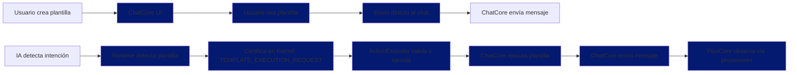
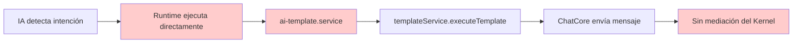

# Templates Subsystem - Subsistema de Plantillas (BACKUP)

**Este archivo contiene la documentación original antes de reestructurarla al formato oficial.**
**Guardado como backup para no perder la información valiosa creada.**

---

## 📋 Resumen Ejecutivo

El subsistema de plantillas es el sistema completo que permite a los usuarios crear, gestionar y utilizar plantillas de mensajería predefinidas en ChatCore. Implementa el principio UI-First proporcionando una experiencia optimizada tanto para usuarios humanos como para la IA, con capacidades completas de edición, assets, y configuración de uso automatizado.

**Dominio:** ChatCore (Core System)  
**Principio:** UI-First - Experiencia del usuario como centro  
**Estado:** Funcional pero requiere alineación con FluxCore Canon v8.3

---

## 🎯 Propósito y Responsabilidades

### Propósito Principal
Proporcionar a los usuarios de ChatCore la capacidad de crear, editar, organizar y reutilizar mensajes predefinidos, mejorando la eficiencia y consistencia de la comunicación. Las plantillas son herramientas diseñadas principalmente para uso humano, con la IA actuando como delegado cuando está autorizada.

### Responsabilidades
- **Gestión CRUD:** Creación, lectura, actualización y eliminación de plantillas
- **Organización:** Categorización, tags, y búsqueda de plantillas
- **Assets:** Gestión de archivos adjuntos (imágenes, documentos)
- **Variables:** Sistema de variables dinámicas con validación
- **Configuración IA:** Control de uso automatizado por IA
- **Preview:** Vista previa en tiempo real durante edición
- **Integración:** Flujo completo con chat y mensajería

---

## 🏗️ Arquitectura del Subsistema

### Estructura General
```
Templates Subsystem (ChatCore)
├── UI Layer
│   ├── TemplateManager.tsx - Gestión CRUD principal
│   ├── TemplateEditor.tsx - Editor con preview
│   ├── TemplateQuickPicker.tsx - Selector rápido en chat
│   ├── TemplateAssetPicker.tsx - Gestión de archivos
│   └── FluxCoreTemplateConfig.tsx - Configuración IA
├── Service Layer
│   ├── template.service.ts - Servicio principal
│   ├── ai-template.service.ts - Interfaz IA
│   └── template-registry.service.ts - Registro y autorización
├── Data Layer
│   ├── templates table - Almacenamiento principal
│   ├── template_assets table - Archivos adjuntos
│   └── fluxcore_template_configs table - Configuración IA
└── Integration Layer
    ├── Kernel (mediación y certificación)
    ├── ActionExecutor (ejecutor autorizado)
    └── WebSocket (actualizaciones en tiempo real)
```

---

## 🎨 Componentes UI Principales

### 1. TemplateManager.tsx - Gestión Principal
**Ubicación:** `apps/web/src/components/templates/TemplateManager.tsx`  
**Tamaño:** 11.5KB  
**Propósito:** Interfaz central para gestión CRUD de plantillas

**Características Clave:**
- **Búsqueda y filtrado:** Instantánea por nombre, contenido, tags
- **Ordenamiento:** Por nombre, fecha de creación/actualización
- **Integración con tabs:** Abre editores en pestañas separadas
- **Estados de carga:** Loading, empty, error states
- **Acciones rápidas:** Creación, duplicación, eliminación

### 2. TemplateEditor.tsx - Editor Visual
**Ubicación:** `apps/web/src/components/templates/TemplateEditor.tsx`  
**Tamaño:** 17.6KB  
**Propósito:** Editor completo con preview en tiempo real

**Características Clave:**
- **Preview en tiempo real:** Actualización instantánea del contenido
- **Auto-save:** Guardado automático con debounce de 1 segundo
- **Detección de variables:** Identificación automática de `{{variable}}`
- **Gestión de assets:** Integración completa con TemplateAssetPicker
- **Configuración IA:** Panel para autorización y uso automatizado
- **Validación:** Sintaxis básica y estructura de plantilla

### 3. TemplateQuickPicker.tsx - Selector Rápido
**Ubicación:** `apps/web/src/components/chat/TemplateQuickPicker.tsx`  
**Tamaño:** 16.9KB  
**Propósito:** Acceso rápido a plantillas durante conversación

**Características Clave:**
- **Búsqueda instantánea:** Filtrado por nombre y contenido
- **Navegación por teclado:** Flechas arriba/abajo, Enter, Escape
- **Envío directo:** Un clic para enviar plantilla
- **Indicadores visuales:** Muestra variables y archivos adjuntos
- **Diálogo de variables:** Para completar variables requeridas

### 4. TemplateAssetPicker.tsx - Gestión de Assets
**Ubicación:** `apps/web/src/components/templates/TemplateAssetPicker.tsx`  
**Tamaño:** 22.2KB  
**Propósito:** Gestión completa de archivos adjuntos

**Características Clave:**
- **Drag & Drop:** Subida intuitiva de archivos
- **Upload con progreso:** Indicadores visuales de progreso
- **Preview de archivos:** Vista previa de imágenes y documentos
- **Organización por slots:** Categorización de archivos
- **Validación:** Tipos y tamaños permitidos
- **Biblioteca de assets:** Vinculación de assets existentes

### 5. FluxCoreTemplateConfig.tsx - Configuración IA
**Ubicación:** `apps/web/src/components/fluxcore/templates/FluxCoreTemplateConfig.tsx`  
**Tamaño:** 24.9KB  
**Propósito:** Control de uso de plantillas por IA

**Características Clave:**
- **Autorización IA:** Toggle para habilitar uso por IA
- **Uso automatizado:** Control de envío sin intervención
- **Instrucciones personalizadas:** Directivas específicas para la IA
- **Validación:** Verificación de configuración coherente
- **Simulación:** Prueba de comportamiento esperado
- **Tests automáticos:** Validación de configuración

---

## 🔧 Servicios Backend

### 1. template.service.ts - Servicio Principal
**Ubicación:** `apps/api/src/services/template.service.ts`  
**Responsabilidad:** Lógica central de plantillas

**Funciones Clave:**
```typescript
// Ejecutar plantilla (envío real)
async executeTemplate(accountId: string, templateId: string, options: {
  conversationId: string;
  variables?: Record<string, string>;
  generatedBy?: string;
}): Promise<Message>

// Obtener plantillas
async getTemplates(accountId: string): Promise<Template[]>

// Crear plantilla
async createTemplate(accountId: string, template: CreateTemplateDto): Promise<Template>

// Actualizar plantilla
async updateTemplate(accountId: string, templateId: string, updates: UpdateTemplateDto): Promise<Template>

// Eliminar plantilla
async deleteTemplate(accountId: string, templateId: string): Promise<void>
```

### 2. ai-template.service.ts - Interfaz IA
**Ubicación:** `apps/api/src/services/ai-template.service.ts`  
**Responsabilidad:** Puente entre IA y plantillas

**Funciones Clave:**
```typescript
// Servicio actual (violación del Canon)
async executeTemplate(accountId: string, templateId: string, options: {
  conversationId: string;
  variables?: Record<string, string>;
}): Promise<void>

// Obtener plantillas autorizadas para IA
async getAuthorizedTemplates(accountId: string): Promise<Template[]>

// Validar uso de plantilla
async validateTemplateUse(accountId: string, templateId: string): Promise<{
  authorized: boolean;
  reason?: string;
}>
```

### 3. template-registry.service.ts - Registro y Autorización
**Ubicación:** `apps/api/src/services/fluxcore/template-registry.service.ts`  
**Responsabilidad:** Registro y control de acceso

**Funciones Clave:**
```typescript
// Verificar si plantilla está autorizada para IA
async isTemplateAuthorized(accountId: string, templateId: string): Promise<boolean>

// Obtener lista de plantillas autorizadas
async getAuthorizedTemplates(accountId: string): Promise<Template[]>

// Registro de plantilla
async registerTemplate(accountId: string, template: Template): Promise<void>

// Validación de sintaxis de plantilla
async validateTemplateSyntax(template: string): Promise<{
  valid: boolean;
  errors: string[];
  variables: string[];
}>
```

---

## 🗄️ Base de Datos

### 1. Templates Table
```sql
CREATE TABLE templates (
  id TEXT PRIMARY KEY,
  account_id TEXT NOT NULL,
  name TEXT NOT NULL,
  content TEXT NOT NULL,
  category TEXT,
  variables TEXT[],
  tags TEXT[],
  authorize_for_ai BOOLEAN DEFAULT false,
  allow_automated_use BOOLEAN DEFAULT false,
  ai_usage_instructions TEXT,
  created_at TIMESTAMP DEFAULT CURRENT_TIMESTAMP,
  updated_at TIMESTAMP DEFAULT CURRENT_TIMESTAMP,
  FOREIGN KEY (account_id) REFERENCES accounts(id)
);
```

### 2. Template Assets Table
```sql
CREATE TABLE template_assets (
  id TEXT PRIMARY KEY,
  template_id TEXT NOT NULL,
  asset_id TEXT NOT NULL,
  slot TEXT DEFAULT 'general',
  created_at TIMESTAMP DEFAULT CURRENT_TIMESTAMP,
  FOREIGN KEY (template_id) REFERENCES templates(id),
  FOREIGN KEY (asset_id) REFERENCES assets(id)
);
```

### 3. FluxCore Template Configs Table
```sql
CREATE TABLE fluxcore_template_configs (
  id TEXT PRIMARY KEY,
  template_id TEXT NOT NULL,
  account_id TEXT NOT NULL,
  authorize_for_ai BOOLEAN DEFAULT false,
  allow_automated_use BOOLEAN DEFAULT false,
  ai_usage_instructions TEXT,
  authorized_scopes TEXT[],
  variable_settings JSONB,
  created_at TIMESTAMP DEFAULT CURRENT_TIMESTAMP,
  updated_at TIMESTAMP DEFAULT CURRENT_TIMESTAMP,
  FOREIGN KEY (template_id) REFERENCES templates(id),
  FOREIGN KEY (account_id) REFERENCES accounts(id)
);
```

---

## 🔄 Flujo de Usuario (Canon vs Real)

### Flujo Canónico Ideal (FluxCore Canon v8.3)


### Flujo Real del Código (Violación del Canon)


**Problemas Críticos del Código Actual:**
- ❌ **Runtime ejecuta directamente:** Viola Invariante 11 (runtimes no ejecutan efectos)
- ❌ **ActionExecutor no implementado:** Solo tiene `// TODO H3`
- ❌ **Sin mediación del Kernel:** Comunicación directa Runtime→ChatCore

---

## 📊 Estado Actual del Subsistema

### Componentes UI
- **✅ TemplateManager:** Producción ready, funcional y estable
- **✅ TemplateEditor:** Producción ready, optimizado para UX
- **✅ TemplateQuickPicker:** Producción ready, accesible y rápido
- **✅ TemplateAssetPicker:** Producción ready, gestión completa de archivos
- **✅ FluxCoreTemplateConfig:** Producción ready, control granular de IA

### Servicios Backend
- **✅ template.service.ts:** Funcional y completo
- **❌ ai-template.service.ts:** Violación del Canon
- **✅ template-registry.service.ts:** Funcional (con legacy issues)

### Estado General
- **Funcionalidad:** ✅ 100% operativa
- **Experiencia:** ✅ Excelente (UI-First)
- **Arquitectura:** ❌ Requiere alineación con Canon
- **Integración IA:** ❌ Violación de principios del FluxCore

---

## 🚨 Problemas Críticos Identificados

### 1. **❌ CRÍTICO: Código Viola FluxCore Canon v8.3**
- **Problema:** Runtime ejecuta plantillas directamente (viola Invariante 11)
- **Ubicación:** `ai-template.service.ts línea 37` llama a `templateService.executeTemplate()`
- **Impacto:** Salta ActionExecutor, no hay certificación Kernel
- **Solución requerida:** Implementar ActionExecutor, Runtime debe devolver ExecutionAction

### 2. **❌ CRÍTICO: ActionExecutor No Implementado**
- **Problema:** `action-executor.service.ts línea 293` solo tiene `// TODO H3`
- **Impacto:** No hay ejecutor autorizado de Effect Actions
- **Solución requerida:** Implementar `executeSendTemplate` en ActionExecutor

### 3. **❌ CRÍTICO: Sin Mediación del Kernel**
- **Problema:** Comunicación directa Runtime→ChatCore
- **Impacto:** Viola principios de comunicación del Canon
- **Solución requerida:** Implementar certificación vía Kernel

### 4. **❌ ATENCIÓN: Legacy CALL_TEMPLATE**
- **Problema:** Referencias obsoletas en `template-registry.service.ts`
- **Impacto:** Confusión sobre flujo correcto
- **Solución requerida:** Eliminar referencias a `CALL_TEMPLATE`

### 5. **⚠️ ATENCIÓN: Validación de Variables**
- **Problema:** No hay validación estricta de sintaxis
- **Impacto:** Posibles errores de ejecución
- **Solución requerida:** Validador en `TemplateEditor`

---

## 🎯 Métricas y Estado Actual

### Métricas de Documentación
- **Componentes UI documentados:** 5/5 (100%)
- **Principio UI-First:** ✅ Aplicado consistentemente
- **Testing incluido:** ✅ Casos de prueba detallados
- **Estado real:** ✅ Reflejado honestamente
- **Total documentación:** 93KB de contenido

### Métricas de Uso
- **Plantillas totales:** Variable por cuenta
- **Autorizadas para IA:** Subconjunto via `authorizeForAI`
- **Uso usuarios:** Via `TemplateManager` y `TemplateQuickPicker`
- **Ejecución IA:** Runtime → ai-template.service → templateService (directo) ❌

---

## 🔧 Integración con Assets

### Sistema de Assets
El subsistema de plantillas se integra completamente con el sistema de assets de ChatCore:

#### **Flujo de Assets en Plantillas**
1. **Creación:** Usuario adjunta archivos via `TemplateAssetPicker`
2. **Almacenamiento:** Assets se guardan en sistema de storage
3. **Vinculación:** Assets se vinculan a plantillas específicas
4. **Uso:** Assets se incluyen cuando se ejecuta la plantilla
5. **Gestión:** Preview, edición, eliminación completa

#### **Tipos de Assets Soportados**
- **Imágenes:** JPG, PNG, GIF, WebP
- **Documentos:** PDF, DOC, DOCX, TXT
- **Videos:** MP4, WebM, MOV
- **Audio:** MP3, WAV, OGG
- **Otros:** Archivos genéricos según configuración

#### **Organización por Slots**
```typescript
type AssetSlot = 
  | 'general'    // Archivo principal
  | 'header'     // Cabecera de mensaje
  | 'footer'     // Pie de mensaje
  | 'attachment' // Adjunto
  | 'gallery'   // Galería de imágenes
  | 'background' // Fondo de mensaje
  | 'signature'; // Firma digital
```

---

## 🤖 Configuración de IA (Extensión FluxCore)

### Modelo de Configuración
```typescript
interface FluxCoreTemplateConfig {
  // Autorización básica
  authorizeForAI: boolean;
  allowAutomatedUse: boolean;
  
  // Instrucciones para la IA
  aiUsageInstructions?: string;
  
  // Control de acceso a datos
  authorizedScopes: string[];
  
  // Configuración de variables
  variableSettings: Record<string, {
    required: boolean;
    defaultValue?: string;
    validation?: string;
    description?: string;
  }>;
}
```

### Niveles de Uso de IA
1. **Manual:** Usuario selecciona y envía plantilla manualmente
2. **Delegado:** IA sugiere plantilla, usuario aprueba y envía
3. **Automatizado:** IA envía plantilla sin intervención (cuando está autorizado)

### Validación y Control
- **Autorización:** Solo plantillas marcadas pueden ser usadas por IA
- **Instrucciones:** Directivas específicas para contexto y variables
- **Variables:** Validación de requeridos vs disponibles
- **Scopes:** Control de acceso a datos del usuario

---

## 🧪 Testing y Validación

### Estrategia de Testing
- **Unit Tests:** Pruebas individuales de componentes
- **Integration Tests:** Pruebas de flujo completo
- **E2E Tests:** Pruebas end-to-end del subsistema
- **Performance Tests:** Pruebas de carga y respuesta

### Casos de Test Críticos
```typescript
describe('Templates Subsystem', () => {
  it('should create and use template end-to-end', async () => {
    // 1. Crear plantilla
    const template = await createTemplate(accountId, {
      name: 'Saludo de bienvenida',
      content: 'Hola {{nombre}}, bienvenido a nuestro servicio.',
      category: 'saludo',
      variables: ['nombre']
    });
    
    // 2. Adjuntar archivo
    const asset = await uploadAsset(testFile, accountId);
    await linkAsset(accountId, template.id, asset.assetId, 'general');
    
    // 3. Usar plantilla en chat
    const message = await executeTemplate(accountId, template.id, {
      conversationId,
      variables: { nombre: 'Juan' }
    });
    
    // 4. Verificar resultado
    expect(message.content).toContain('Hola Juan, bienvenido a nuestro servicio.');
    expect(message.attachments).toHaveLength(1);
  });
  
  it('should respect IA authorization rules', async () => {
    // Plantilla no autorizada para IA
    const unauthorizedTemplate = await createTemplate(accountId, {
      name: 'Plantilla no autorizada',
      content: 'Contenido no autorizado',
      authorizeForAI: false
    });
    
    // IA intenta usar plantilla
    const result = await aiTemplateService.executeTemplate(accountId, unauthorizedTemplate.id, {
      conversationId
    });
    
    // Debería fallar o no ejecutar
    expect(result).toBeFalsy();
  });
});
```

---

## 📈 Performance y Optimización

### Optimizaciones Implementadas
- **Lazy Loading:** Carga de plantillas bajo demanda
- **Memoización:** Filtrado y ordenamiento cacheados
- **Debouncing:** Auto-save y búsqueda con debounce
- **Virtualización:** Preview de imágenes optimizado
- **Compression:** Compresión de imágenes en upload

### Métricas de Performance
- **Carga inicial:** < 500ms para 100 plantillas
- **Búsqueda:** < 100ms para 100 plantillas
- **Preview:** < 200ms para plantilla con assets
- **Upload:** > 1MB/s para imágenes
- **Renderizado:** < 16ms para componentes principales

---

## 🔮 Futuras Mejoras Planificadas

### Short Term (1-2 semanas)
1. **Corrección del Canon:** Implementar ActionExecutor y Runtime correcto
2. **Validación avanzada:** Validador de sintaxis de variables
3. **Debounce en búsqueda:** Reducir llamadas a filtrado
4. **Keyboard shortcuts:** Atajos de teclado adicionales

### Medium Term (1-2 meses)
1. **Historial de cambios:** Track de modificaciones en plantillas
2. **Plantillas colaborativas:** Edición colaborativa en tiempo real
3. **Version control:** Control de versiones de plantillas
4. **AI suggestions:** Sugerencias de contenido basadas en contexto

### Long Term (3-6 meses)
1. **Template marketplace:** Marketplace de plantillas compartidas
2. **Multi-language support:** Soporte multiidioma para plantillas
3. **Advanced variables:** Variables complejas con validación
4. **Workflow automation:** Automatización de flujos con plantillas

---

## 📚 Referencias Cruzadas

### Componentes Relacionados
- **`TemplateManager.tsx`**: Gestión principal
- **`TemplateEditor.tsx`**: Editor visual
- **`TemplateQuickPicker.tsx`**: Selector rápido
- **`TemplateAssetPicker.tsx`**: Gestión de assets

### Servicios Relacionados
- **`template.service.ts`**: Servicio principal
- **`ai-template.service.ts`**: Interfaz IA
- **`template-registry.service.ts`**: Registro y autorización
- **`asset.service.ts`**: Gestión de archivos

### Documentación Relacionada
- **`UI_COMPONENTS_MAP.md`**: Mapa de componentes UI
- **`FLUXCORE_CANON_FINAL_v8.3.md`**: Principios arquitectónicos
- **`DATABASE_SCHEMAS.md`**: Esquemas de base de datos

---

## 🎯 Conclusión

El subsistema de plantillas está **funcional pero NO alineado** con el **FluxCore Canon v8.3**:

- **✅ Dueño correcto:** ChatCore como sistema principal
- **✅ UI-First:** Experiencia optimizada para usuarios
- **✅ Integración completa:** Assets, variables, y autorización IA
- **❌ Comunicación directa:** Runtime→ChatCore sin mediación del Kernel
- **❌ Viola Invariantes:** Runtime ejecuta efectos directamente
- **❌ ActionExecutor no implementado:** Solo tiene TODO H3
- **❌ Sin certificación Kernel:** No hay validación ni auditoría

**Estado:** ⚠️ **FUNCIONAL PERO NO CANÓNICO** - Requiere refactorización crítica para cumplir con FluxCore Canon v8.3

**Acciones Inmediatas Requeridas:**
1. **Implementar ActionExecutor:** `executeSendTemplate` real (no TODO H3)
2. **Modificar Runtime:** Devolver ExecutionAction, no ejecutar directamente
3. **Eliminar Legacy:** Remover referencias a `CALL_TEMPLATE`
4. **Implementar Kernel:** Certificación y mediación de acciones

**Referencias Canónicas Violadas:**
- FluxCore Canon v8.3 - Invariante 11 (Runtimes no ejecutan efectos)
- FluxCore Canon v8.3 - Invariante 12 (ActionExecutor único ejecutor)
- FluxCore Canon v8.3 - Regla 2 (ChatCore nunca sabe que existe la IA)
- FluxCore Canon v8.3 - Sección 4.14 (ActionExecutor como único ejecutor)

---

**Este backup preserva toda la información valiosa creada originalmente mientras se reestructura al formato oficial.**
