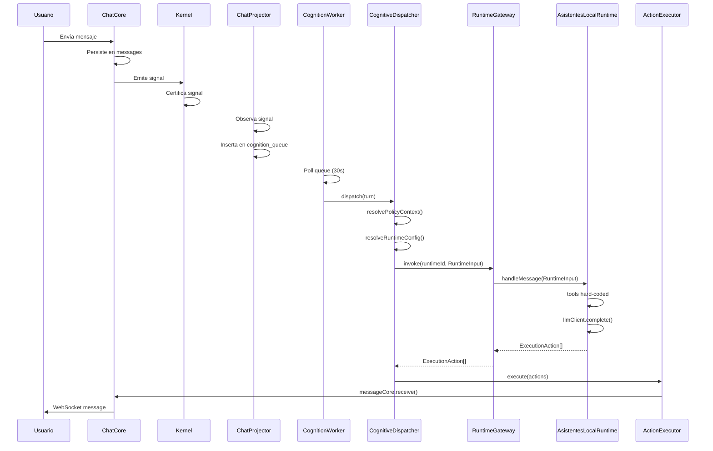

# Diagnóstico de Arquitectura FluxCoreChat — Estado Real vs. Documentación

**Fecha:** 2026-03-19  
**Propósito:** Entender POR QUÉ los roadmaps T1/T2 fallaron y qué necesita el sistema realmente  
**Metodología:** Análisis de código real, flujo de datos, y puntos de fricción

---

## 🔍 1. Arquitectura REAL del Sistema (vs Documentación)

### 1.1 El Pipeline Cognitivo ACTUAL (confirmado en código)

```
Usuario envía mensaje
       ↓
ChatCore persiste en `messages`
       ↓
Outbox emite signal → Kernel certifica
       ↓
ChatProjector observa signal → encola en `cognition_queue`
       ↓
CognitionWorker (poll 30s) toma turn
       ↓
CognitiveDispatcher.resuelve():
  - PolicyContext (gobernanza)
  - RuntimeConfig (asistente activo)
  - ConversationHistory (mensajes)
       ↓
RuntimeGateway.invoke(runtimeId, RuntimeInput)
       ↓
AsistentesLocalRuntime.handleMessage(RuntimeInput)
  - tools hard-coded (SEARCH_KNOWLEDGE_TOOL, SEND_TEMPLATE_TOOL)
  - promptBuilder.build()
  - llmClient.complete()
  - tool calling loop
       ↓
Retorna ExecutionAction[]
       ↓
ActionExecutor ejecuta efectos
  - messageCore.receive() → persiste + WebSocket
  - templateService.send()
```

### 1.2 El Problema Fundamental: **RuntimeInput NO incluye services**

**En los tipos (`fluxcore-types.ts`):**
```typescript
export interface RuntimeInput {
    policyContext: FluxPolicyContext;
    runtimeConfig: RuntimeConfig;
    conversationHistory: ConversationMessage[];
    // ❌ NO HAY "services" aquí
}
```

**En el runtime real (`asistentes-local.runtime.ts`):**
```typescript
// Línea 85: handleMessage(input: RuntimeInput)
const { policyContext, runtimeConfig, conversationHistory } = input;

// ❌ IMPORTS DIRECTOS - violación de soberanía
import { promptBuilder } from '../prompt-builder.service';
import { llmClient } from '../llm-client.service';

// ❌ TOOLS HARD-CODED - no extensibilidad
const SEARCH_KNOWLEDGE_TOOL: LLMTool = { ... };
const SEND_TEMPLATE_TOOL: LLMTool = { ... };
```

### 1.3 La Extensión Legacy SÍ tiene ToolRegistry

**En `extensions/fluxcore-asistentes/src/tools/registry.ts`:**
```typescript
export class ToolRegistry {
  constructor(private deps: ToolRegistryDeps) {}
  
  getToolsForAssistant(context: ToolOfferContext): OpenAIToolDef[]
  executeToolCall(toolCall, context): ToolExecutionResponse
}
```

**PERO:** La extensión está **desconectada** del pipeline actual. El runtime usa tools hard-coded, no el ToolRegistry maduro.

---

## 🎯 2. Flujo de Datos End-to-End (Estado Real)

### 2.1 Mensaje → AI Response



### 2.2 Puntos Críticos de Fractura

| Punto | Problema Real | Impacto |
|-------|---------------|---------|
| **RuntimeInput** | Sin `services` | Runtime no puede descubrir herramientas dinámicamente |
| **AsistentesLocalRuntime** | Imports directos | Violación de sandbox, no testeable |
| **Tools** | Hard-coded | No extensibilidad, cada nueva tool requiere modificar runtime |
| **ToolRegistry** | En extensión desconectada | Código maduro no utilizado |
| **PromptBuilder** | Import directo | Acoplamiento fuerte, no inyectable |

---

## 🚨 3. Por Qué Fallaron T1/T2

### 3.1 T1: "Arquitectura de Pilares del Runtime"

**Lo que intentaste:** Definir cómo los runtimes acceden a capacidades del sistema.

**Por qué falló:** 
- El diseño asumía `RuntimeInput.services` que **no existe**
- El runtime actual **no usa pilares** - usa imports directos
- El ToolRegistry real está en la extensión, no en el pipeline

**Raíz:** Estabas diseñando para un sistema ideal, no el sistema real.

### 3.2 T2: "Runtime Pipeline + Signal Hub"

**Lo que intentaste:** Extender el pipeline con telemetría y extensibilidad.

**Por qué falló:**
- El pipeline ya existe pero está **incompleto**
- Los runtimes no son extensibles porque están hard-coded
- La telemetría requiere modificar runtimes que no son modulares

**Raíz:** Estabas extendiendo algo que no estaba terminado.

---

## 🏗️ 4. Lo que el Sistema REAL Necesita

### 4.1 Problema Central: **El Runtime No Es Soberano**

**Canon dice:** Runtime es soberano, recibe todo en RuntimeInput.

**Realidad:** Runtime hace imports directos, tools hard-coded, no recibe services.

### 4.2 Solución: **Inyectar Servicios en RuntimeInput**

```typescript
// ✅ RuntimeInput CORREGIDO
export interface RuntimeInput {
    policyContext: FluxPolicyContext;
    runtimeConfig: RuntimeConfig;
    conversationHistory: ConversationMessage[];
    
    // 🔥 NUEVO: pilares del sistema
    services: RuntimeServices;
}

export interface RuntimeServices {
    llmClient: LLMServices;
    toolRegistry: ToolRegistryServices;
}
```

### 4.3 Migración del Runtime Actual

**ANTES (violación):**
```typescript
import { promptBuilder } from '../prompt-builder.service';
import { llmClient } from '../llm-client.service';

const tools: LLMTool[] = [];
if (hasRAG) tools.push(SEARCH_KNOWLEDGE_TOOL);
if (hasTemplates) tools.push(SEND_TEMPLATE_TOOL);
```

**DESPUÉS (soberano):**
```typescript
async handleMessage(input: RuntimeInput): Promise<ExecutionAction[]> {
    const { policyContext, runtimeConfig, conversationHistory, services } = input;
    
    // ✅ Servicios inyectados, no imports
    const prompt = services.promptBuilder.build({...});
    const tools = services.toolRegistry.getAvailableTools();
    const result = await services.llmClient.complete({...});
    
    // ✅ Ejecución vía servicio, no hard-coded
    if (result.toolCalls) {
        for (const call of result.toolCalls) {
            const toolResult = await services.toolRegistry.executeTool(call.slug, call.params);
            // ...
        }
    }
}
```

---

## 📋 5. Roadmap Corregido (Basado en Realidad)

### Fase 1: **Corrección del RuntimeInput** (Semana 1)
1. **Actualizar `RuntimeInput`** para incluir `services: RuntimeServices`
2. **Crear `RuntimeServices` interface** con `llmClient` y `toolRegistry`
3. **Migrar `CognitiveDispatcher`** para inyectar services
4. **Actualizar `AsistentesLocalRuntime`** para usar services inyectados

### Fase 2: **ToolRegistry Central** (Semana 2)
1. **Crear `ToolRegistryService`** en `apps/api/src/services/fluxcore/`
2. **Mover lógica de ToolRegistry** desde extensión al servicio central
3. **Implementar descubrimiento dinámico** desde BD (`fluxcore_tool_definitions`)
4. **Registrar ejecutores** por slug (search_knowledge, send_template)

### Fase 3: **Extensibilidad Real** (Semana 3)
1. **Probar nueva tool** sin modificar runtime
2. **Agregar tool de ejemplo** (`get_business_hours`)
3. **Validar filtrado** por asistente
4. **Tests anti-regresión**

---

## 🔧 6. Metodología de Implementación Robusta

### 6.1 Principio de Realidad Primero
- **NO diseñar para el sistema ideal**
- **Diseñar para el sistema real**
- **Cada cambio debe ser verificable en código**

### 6.2 Secuencia de Verificación
1. **Estado actual** → ¿Qué hay HOY?
2. **Cambio mínimo** → ¿Qué se necesita cambiar?
3. **Verificación** → ¿Cómo sé que funcionó?
4. **Anti-regresión** → ¿Cómo evito romper lo existente?

### 6.3 Tests Obligatorios por Cambio
```typescript
// Test 1: El runtime no hace imports directos
expect(runtimeSource).not.toContain('import.*from.*service');

// Test 2: Las tools vienen del servicio
expect(tools).toEqual(await services.toolRegistry.getAvailableTools());

// Test 3: Nueva tool aparece sin cambiar runtime
await registerTool('new_tool');
expect(await services.toolRegistry.getAvailableTools()).toContain('new_tool');
```

---

## 🎯 7. Próximos Pasos Inmediatos

### 7.1 Hoy: Verificación del Estado Actual
```bash
# 1. Verificar que RuntimeInput no tiene services
grep -n "interface RuntimeInput" apps/api/src/core/fluxcore-types.ts

# 2. Verificar que runtime hace imports directos
grep -n "import.*service" apps/api/src/services/fluxcore/runtimes/asistentes-local.runtime.ts

# 3. Verificar que ToolRegistry está en extensión
find . -name "registry.ts" -path "*/extensions/*"
```

### 7.2 Mañana: Primer Cambio Verificable
1. **Agregar `services: RuntimeServices` a `RuntimeInput`**
2. **Verificar que el build pasa**
3. **Crear test que falle antes del cambio y pase después**

### 7.3 Esta Semana: Migración Controlada
1. **Migrar un solo import** (llmClient)
2. **Verificar que el runtime sigue funcionando**
3. **Migrar el siguiente import** (tools)
4. **Verificar extensibilidad con nueva tool**

---

## 💡 8. Lecciones Aprendidas

### 8.1 Por Qué Fallaron los Roadmaps Anteriores
- **Diseño en vacío:** Sin verificar el estado real del sistema
- **Suposiciones incorrectas:** Asumir que `RuntimeInput.services` existía
- **Cambio grande:** Intentar refactorizar todo junto
- **Sin verificación:** No tener tests que confirmen el cambio

### 8.2 Cómo Evitarlo en el Futuro
- **Diagnóstico primero:** Entender el sistema ANTES de diseñar
- **Cambios mínimos:** Un cambio a la vez, verificado
- **Tests anti-regresión:** Cada cambio debe tener test
- **Documentación viva:** Actualizar docs DESPUÉS del código, no antes

---

## ✅ 9. Conclusión

**El problema no fue el diseño, fue la falta de conexión con la realidad.**

El sistema FluxCoreChat tiene una arquitectura sólida pero **incompleta**:
- ✅ Pipeline cognitivo existe y funciona
- ✅ ToolRegistry maduro existe (en extensión)
- ❌ RuntimeInput no inyecta servicios
- ❌ Runtime no usa servicios inyectados

**La solución es simple:**
1. **Corregir RuntimeInput** para incluir services
2. **Migrar runtime** para usar services inyectados
3. **Centralizar ToolRegistry** del servicio
4. **Probar extensibilidad** con nueva tool

**Con esta base, los roadmaps T1/T2 pueden implementarse correctamente.**

---

*Documento basado en código real, no en suposiciones.*  
*Cada cambio propuesto es verificable con el sistema actual.*
