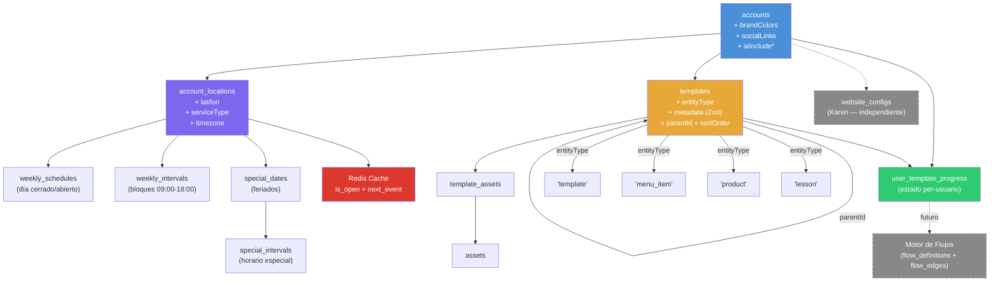

# FluxCore Platform Evolution — Architectural Plan (Consolidated)

> This document merges the original analysis with the owner's review corrections.
> **Decisions are locked unless explicitly reopened.**

---

## Decisiones Arquitectónicas (Cerradas)

| # | Decisión | Alternativa Descartada | Razón |
|---|----------|----------------------|-------|
| D1 | **Tablas relacionales** para horarios desde día 1 | JSONB en accounts | Ambos consumidores (IA + algoritmo) lo necesitan. Parsear JSON en cada request es inaceptable |
| D2 | **`metadata` con validación Zod** por `entityType` | JSONB libre sin schema | Un metadata caótico mata el producto. Cada entityType define su schema |
| D3 | **`account_locations`** como tabla dedicada | Campos lat/lon en accounts | Soporta multi-sede desde el inicio |
| D4 | **`lat/lon` como REAL** sin PostGIS | PostGIS + geometría | Innecesario hasta +50 sucursales. Haversine en aplicación |
| D5 | **`website_configs` es dominio separado** | Reutilizar company.address de Karen | La ubicación es dato de la cuenta, no del sitio web |
| D6 | **`serviceType`** en locations | Solo coverageRadius | Un local puede tener pickup sin límite + delivery con radio |
| D7 | **Cache Redis** para estado abierto/cerrado | Calcular en cada request | Vital para horas pico. Pattern: `is_open` + `next_event_time` |
| D8 | **`user_template_progress`** como tabla dedicada ahora | Diferir hasta tener motor de flujos | Es estado dinámico per-usuario, independiente de flujos. Cubre 80% de casos (cursos, onboarding, checklists). Un futuro motor de flujos coexistirá, no la reemplazará |
| D9 | **`timezone` y `country` en `accounts`** | Timezone por sede | Al restringir un solo país por cuenta (D10), la zona horaria es una propiedad de identidad. Evita desincronización y simplifica cálculos de apertura |
| D10 | **Restricción de país único** | Cuentas multi-país | Una empresa no podrá tener sedes en países distintos bajo la misma cuenta. Simplifica moneda, leyes y lógica de tiempo. Si escala, se crean cuentas hermanas |
| D11 | **Sistema de Horarios Universal** | Horarios acoplados a sedes | El motor de horarios y la UI se diseñan como módulos puros. Hoy sirven a sedes, mañana a empleados o citas sin cambiar la lógica base |

---

## Fase 1: Account & Brand

**Objetivo**: Enriquecer `accounts` con identidad comercial y controles de visibilidad IA.

### [MODIFY] accounts.ts

Nuevos campos (migración):

```typescript
// === Brand Identity ===
brandColors: jsonb('brand_colors')
  .$type<{ primary?: string; secondary?: string; accent?: string }>()
  .default({}),

socialLinks: jsonb('social_links')
  .$type<{
    instagram?: string;
    facebook?: string;
    whatsapp?: string;
    website?: string;
    tiktok?: string;
  }>()
  .default({}),

// === AI Visibility Toggles (extensión del patrón existente) ===
aiIncludeLocation: boolean('ai_include_location').default(true).notNull(),
aiIncludeSchedule: boolean('ai_include_schedule').default(true).notNull(),
aiIncludeSocialLinks: boolean('ai_include_social_links').default(true).notNull(),

// === Regional SSOT (D9, D10) ===
country: varchar('country', { length: 2 }).default('AR'), // ISO code (ES, MX, US, etc)
timezone: varchar('timezone', { length: 50 }).default('America/Argentina/Buenos_Aires').notNull(),
```

> [!NOTE]
> Para V1, los toggles son booleanos por categoría (`aiIncludeLocation`, `aiIncludeSchedule`).
> En el futuro, se puede evolucionar a un **modelo de permisos por atributo** (ej: compartir ubicación pero no teléfono, compartir horario público pero no horario de cocina). Esa evolución no requiere cambiar el schema — se haría con un JSONB de permisos granulares.

---

## Fase 2: Ubicaciones (Sedes)

**Objetivo**: Sistema de gestión de sedes físicas con interfaz "Search-First", delegando la precisión técnica a Google Maps pero manteniendo la soberanía del usuario sobre la dirección escrita.

### Principios de Implementación (Realidad Técnica)

1. **Interfaz Search-First**: Se ocultan los campos técnicos (país, ciudad, etc.). El usuario solo ve un buscador (Nominatim) y un mapa.
2. **Fuente de Verdad (Address)**: El valor escrito en `address` es inmutable por el sistema. El mapa sirve para obtener coordenadas y datos de respaldo, pero nunca sobrescribe el texto manual del usuario.
3. **Flujo de Pestañas (FluxCore Native)**: La creación/edición de sedes ocurre en una pestaña independiente disparada por `onOpenTab`. El cierre es automático tras el éxito del guardado mediante `closeTab`.
4. **Optimización de Costos (Deferred Geocoding)**:
   - **Búsqueda**: Usa Nominatim (Gratis).
   - **Movimiento de Mapa**: Gratis (solo actualiza lat/lon internos).
   - **Geocoding API**: Se ejecuta **una sola vez** al hacer clic en "Guardar" únicamente si el usuario movió el mapa manualmente o si faltan datos técnicos esenciales. Si se selecciona un resultado de búsqueda y no se mueve el mapa, el costo es **$0**.
5. **Precisión y Seguridad**: Interacción cooperativa obligatoria (2 dedos en móvil, Ctrl en escritorio) para evitar cambios involuntarios de ubicación.

### [NEW] account-locations.ts

```typescript
export const accountLocations = pgTable('account_locations', {
  id: uuid('id').primaryKey().defaultRandom(),
  accountId: uuid('account_id')
    .notNull()
    .references(() => accounts.id, { onDelete: 'cascade' }),

  // Identificación
  name: varchar('name', { length: 255 }).notNull(),       // "Sede Central", "Sucursal Norte"
  address: text('address'),                                 // Dirección legible para humanos
  
  // Coordenadas (sin PostGIS — Haversine en app)
  lat: real('lat'),
  lon: real('lon'),

  // Servicio
  serviceType: varchar('service_type', { length: 20 })     // 'delivery' | 'pickup' | 'both' | 'online_only'
    .default('both'),
  coverageRadiusKm: real('coverage_radius_km'),            // Comportamiento según serviceType (ver reglas abajo)

  // Contacto por sede
  phone: varchar('phone', { length: 50 }),
  email: varchar('email', { length: 255 }),

  // Zona horaria — ELIMINADA DE SEDE (D9)
  // Ahora se usa accounts.timezone como fuente única de verdad.

  // Estado
  status: varchar('status', { length: 20 })
    .default('active'),                                     // 'active' | 'temp_closed' | 'perm_closed'
  isDefault: boolean('is_default').default(false),          // Para escenario "un solo local"

  // Extensible
  metadata: jsonb('metadata').default({}),

  createdAt: timestamp('created_at').defaultNow().notNull(),
  updatedAt: timestamp('updated_at').defaultNow().notNull(),
}, (table) => ({
  accountIdx: index('idx_account_locations_account').on(table.accountId),
  statusIdx: index('idx_account_locations_status').on(table.status),
}));
```

### Constraint: Timezone obligatorio si existen horarios

El campo `timezone` es nullable en la DB para permitir ubicaciones sin horarios (ej: `online_only`). Pero si la ubicación tiene **cualquier fila** en `weekly_schedules`, `weekly_intervals` o `special_dates`, el timezone es **obligatorio**.

Esto se aplica en el **service layer**, no como constraint de DB, para mantener el schema simple:

```typescript
// En location.service.ts — al crear/editar horarios
async function ensureTimezoneBeforeSchedule(locationId: string): void {
  const [location] = await db
    .select({ timezone: accountLocations.timezone })
    .from(accountLocations)
    .where(eq(accountLocations.id, locationId));

  if (!location?.timezone) {
    throw new ValidationError(
      'TIMEZONE_REQUIRED',
      'La ubicación debe tener zona horaria configurada antes de asignar horarios.'
    );
  }
}
```

### Reglas de `coverageRadiusKm` según `serviceType`

| `serviceType` | `coverageRadiusKm` | Comportamiento |
|---|---|---|
| `delivery` | **Obligatorio** | El usuario debe estar dentro del radio para poder pedir. Si no se define, el delivery queda deshabilitado |
| `pickup` | **Ignorado** | El cliente va al local. No hay restricción de distancia. Se muestra la distancia como referencia, pero nunca se bloquea |
| `both` | **Obligatorio** | Se aplica solo al delivery. Pickup siempre disponible sin importar distancia |
| `online_only` | **Irrelevante** | No hay interacción física. El campo se ignora completamente |

Validación en service layer:

```typescript
function validateLocationService(serviceType: string, coverageRadiusKm: number | null): void {
  const needsRadius = serviceType === 'delivery' || serviceType === 'both';
  if (needsRadius && (coverageRadiusKm == null || coverageRadiusKm <= 0)) {
    throw new ValidationError(
      'COVERAGE_RADIUS_REQUIRED',
      `serviceType "${serviceType}" requiere coverageRadiusKm > 0`
    );
  }
}
```

> [!IMPORTANT]
> **Geocoding Strategy**: El sistema usa un enfoque híbrido. Nominatim (OSM) para la búsqueda inicial gratuita y Google Maps Geocoding API para la resolución técnica final. La resolución técnica solo se dispara al guardar si el usuario ha interactuado con el mapa o si faltan datos obligatorios.

---

### Descubrimiento de Locations (Multi-Sede)

Cuando una cuenta tiene múltiples sedes, el sistema necesita un algoritmo de **descubrimiento** para determinar qué location(s) son relevantes para un usuario.

#### Algoritmo `discoverLocations(accountId, userPosition?)`

```typescript
interface UserPosition {
  lat: number;
  lon: number;
  source: 'gps' | 'geocoded' | 'ip_approximate';
}

interface DiscoveryResult {
  location: AccountLocation;
  distanceKm: number | null;        // null si no hay posición del usuario
  isWithinDeliveryRadius: boolean;   // solo aplica si serviceType incluye delivery
  isOpen: boolean;                   // del cache Redis
}

async function discoverLocations(
  accountId: string,
  userPosition?: UserPosition,
  filters?: { serviceType?: 'delivery' | 'pickup' }
): Promise<DiscoveryResult[]> {

  // 1. Obtener todas las sedes activas de la cuenta
  const locations = await db.select()
    .from(accountLocations)
    .where(and(
      eq(accountLocations.accountId, accountId),
      eq(accountLocations.status, 'active')
    ));

  // 2. Si la cuenta tiene una sola sede → devolverla directamente
  if (locations.length === 1) {
    return [buildResult(locations[0], userPosition)];
  }

  // 3. Filtrar por tipo de servicio si se especifica
  let filtered = locations;
  if (filters?.serviceType === 'delivery') {
    filtered = locations.filter(l =>
      l.serviceType === 'delivery' || l.serviceType === 'both'
    );
  } else if (filters?.serviceType === 'pickup') {
    filtered = locations.filter(l =>
      l.serviceType === 'pickup' || l.serviceType === 'both'
    );
  }

  // 4. Si no hay posición del usuario → devolver todas ordenadas por isDefault
  if (!userPosition) {
    return filtered
      .sort((a, b) => (b.isDefault ? 1 : 0) - (a.isDefault ? 1 : 0))
      .map(l => buildResult(l, null));
  }

  // 5. Calcular distancia Haversine para cada sede
  const withDistance = filtered.map(l => ({
    location: l,
    distanceKm: l.lat && l.lon
      ? haversineKm(userPosition.lat, userPosition.lon, l.lat, l.lon)
      : Infinity,
  }));

  // 6. Ordenar por distancia ascendente
  withDistance.sort((a, b) => a.distanceKm - b.distanceKm);

  // 7. Enriquecer con estado abierto/cerrado (del cache) y radio de cobertura
  return Promise.all(withDistance.map(async ({ location, distanceKm }) => {
    const isOpen = await getCachedOpenStatus(location.id);
    const isWithinDeliveryRadius =
      (location.serviceType === 'delivery' || location.serviceType === 'both')
        ? distanceKm <= (location.coverageRadiusKm ?? 0)
        : true; // pickup no tiene restricción de distancia

    return {
      location,
      distanceKm: distanceKm === Infinity ? null : distanceKm,
      isWithinDeliveryRadius,
      isOpen,
    };
  }));
}
```

#### Fallbacks cuando no hay GPS

| Escenario | Acción |
|---|---|
| Usuario con GPS habilitado | Coordenadas directas → Haversine |
| Usuario sin GPS pero con dirección escrita | Geocoding (Mapbox/Google) → coordenadas → Haversine |
| Usuario sin GPS y sin dirección | Mostrar todas las sedes con la default primero. Ofrecer selector manual |
| IP geolocation | Solo como último recurso. Precisión de ~ciudad. Marcar `source: 'ip_approximate'` |

---

## Fase 1: Account & Brand [DONE]

**Objetivo**: Enriquecer `accounts` con identidad comercial y controles de visibilidad IA.

---

## Fase 2: Ubicaciones (Sedes) [DONE]

**Objetivo**: Sistema de gestión de sedes físicas con interfaz "Search-First", delegando la precisión técnica a Google Maps pero manteniendo la soberanía del usuario sobre la dirección escrita.

---

## Fase 3: Sistema Universal de Horarios (Desacoplado) [PARTIALLY DONE]

**Objetivo**: Sistema completo de horarios con patrón polimórfico (`ownerType` + `ownerId`) que hoy sirve a sedes pero es reutilizable para empleados, servicios, entregas, etc.

### Estado Actual:
- [x] **Infraestructura DB**: Tablas `weekly_schedules`, `weekly_intervals`, `special_dates`, `special_intervals` implementadas.
- [x] **Regional SSOT**: `country` y `timezone` agregados a `accounts`. `timezone` eliminado de `locations`.
- [x] **Backend API**: `ScheduleService` con CRUD básico y `schedules.routes.ts` operativos.
- [x] **Frontend UI**: Componente `ScheduleEditor` y página de ajustes (`ScheduleSection`) implementados.
- [x] **Sincronización de Estado**: Corregido bug de "Configuración pendiente" mediante sincronización en `useProfile`, `useContextSync` y `useContextRefresh`.
- [ ] **Algoritmo `isBusinessOpen`**: Lógica de cálculo en tiempo real pendiente en el backend.
- [ ] **Cache Redis (Fase 3.1)**: Pendiente (Diferido).

### Decisiones Resueltas (Fase 3)

| Decisión | Resultado | Razón |
|---|---|---|
| Schema polimórfico | `ownerType` + `ownerId` en lugar de `locationId` FK | Reutilización universal sin duplicar tablas |
| Timezone SSOT | En `accounts`, no en sedes (D9) | Un país = una zona horaria por cuenta |
| `country` + `timezone` en accounts | Se agregan en esta fase | Son prerequisito para horarios y configuración integral |
| Redis cache | **Diferido** (Fase 3.1) | El sistema funciona con cálculo on-demand. Cache es optimización para alto tráfico |
| Migración | `drizzle-kit generate` primero, SQL manual como fallback | Eficiencia pragmática |

### Ruta de Implementación
- **URL**: `/@/[account_slug]/ajustes/horario`
- **Navegación**: Se accede desde el menú de ajustes de marca.
- **Contexto**: 
    - **Sede Única**: Se muestra el editor directamente **sin header de sede**. El `ownerId` se resuelve automáticamente.
    - **Multi-sede**: Se muestra una lista agrupada por sede, cada una con sus horarios colapsados y un botón `[+ Agregar horario]`.

> [!IMPORTANT]
> Los horarios son **por sede**, no por cuenta. Pero la **zona horaria** es por cuenta (D9), ya que todas las sedes están en el mismo país (D10).

### [NEW] `packages/db/src/schema/schedules.ts` — Schema Polimórfico

```typescript
import { pgTable, uuid, varchar, integer, boolean, time, date, index, primaryKey, unique, timestamp } from 'drizzle-orm/pg-core';

// === Horarios semanales regulares ===

export const weeklySchedules = pgTable('weekly_schedules', {
  ownerType: varchar('owner_type', { length: 30 }).notNull(),  // 'location' | 'employee' | ...
  ownerId: uuid('owner_id').notNull(),
  dayOfWeek: integer('day_of_week').notNull(),                  // 0=domingo ... 6=sábado
  isClosed: boolean('is_closed').notNull().default(false),
}, (table) => ({
  pk: primaryKey({ columns: [table.ownerType, table.ownerId, table.dayOfWeek] }),
}));

export const weeklyIntervals = pgTable('weekly_intervals', {
  id: uuid('id').primaryKey().defaultRandom(),
  ownerType: varchar('owner_type', { length: 30 }).notNull(),
  ownerId: uuid('owner_id').notNull(),
  dayOfWeek: integer('day_of_week').notNull(),
  openTime: time('open_time').notNull(),                        // '09:00:00'
  closeTime: time('close_time').notNull(),                      // '18:00:00'
}, (table) => ({
  lookupIdx: index('idx_weekly_intervals_lookup')
    .on(table.ownerType, table.ownerId, table.dayOfWeek, table.openTime),
}));
// Regla: Si cruza medianoche → split en dos intervalos

// === Excepciones (feriados, días especiales) ===

export const specialDates = pgTable('special_dates', {
  id: uuid('id').primaryKey().defaultRandom(),
  ownerType: varchar('owner_type', { length: 30 }).notNull(),
  ownerId: uuid('owner_id').notNull(),
  date: date('date').notNull(),                                  // '2026-12-25'
  isClosed: boolean('is_closed').notNull().default(true),
  label: varchar('label', { length: 100 }),                      // "Navidad", "Feriado nacional"
}, (table) => ({
  lookupIdx: index('idx_special_dates_lookup')
    .on(table.ownerType, table.ownerId, table.date),
  unq: unique().on(table.ownerType, table.ownerId, table.date),
}));

export const specialIntervals = pgTable('special_intervals', {
  id: uuid('id').primaryKey().defaultRandom(),
  specialDateId: uuid('special_date_id')
    .notNull()
    .references(() => specialDates.id, { onDelete: 'cascade' }),
  openTime: time('open_time').notNull(),
  closeTime: time('close_time').notNull(),
});

// Types
export type WeeklySchedule = typeof weeklySchedules.$inferSelect;
export type NewWeeklySchedule = typeof weeklySchedules.$inferInsert;
export type WeeklyInterval = typeof weeklyIntervals.$inferSelect;
export type NewWeeklyInterval = typeof weeklyIntervals.$inferInsert;
export type SpecialDate = typeof specialDates.$inferSelect;
export type NewSpecialDate = typeof specialDates.$inferInsert;
export type SpecialInterval = typeof specialIntervals.$inferSelect;
export type NewSpecialInterval = typeof specialIntervals.$inferInsert;
```

### Reutilización Futura (D11)

| `ownerType` | `ownerId` | Caso de Uso |
|-------------|-----------|-------------|
| `location` | UUID de la sede | Horario de atención del local |
| `employee` | UUID del empleado | Horario laboral |
| `delivery_window` | UUID de la ventana | Ventanas de entrega disponibles |
| `service` | UUID del servicio | Horarios específicos de un servicio |

> [!NOTE]
> **Trade-off de integridad**: Al usar `ownerId` genérico no hay FK directa. La integridad se valida en el service layer. Cuando se elimina una sede, el service de eliminación DEBE llamar `deleteSchedulesForOwner('location', locationId)` explícitamente.

### [MODIFY] `packages/db/src/schema/accounts.ts` — Agregar D9/D10

```typescript
// Campos nuevos a agregar:
country: varchar('country', { length: 2 }),                      // ISO 3166-1 alpha-2 (AR, ES, MX)
timezone: varchar('timezone', { length: 50 }),                   // IANA (America/Argentina/Buenos_Aires)
```

### [MODIFY] `packages/db/src/schema/locations.ts` — Eliminar timezone

Se elimina el campo `timezone` de `account_locations`. Ahora se usa `accounts.timezone` como fuente única de verdad (D9).

---

### [UX/UI] Prototipo Visual y Experiencia de Usuario (Fase 3)

[ignoring loop detection]

#### Vista Principal: `/ajustes/horario`

**Multi-sede** — Lista agrupada por sede:

```
Sede Norte          [+ Agregar horario]
  └── Lunes  09:00 - 18:00
  └── Martes 09:00 - 18:00

Sede Sur            [+ Agregar horario]
  └── (sin horario configurado)

Sede Centro         [+ Agregar horario]
  └── Lunes  10:00 - 20:00
```

**Sede única** — Se muestra directamente sin el header de sede:

```
Horario de atención          [+ Agregar horario]
  └── Lunes  09:00 - 18:00
  └── Martes 09:00 - 18:00
```

#### Vista de Edición: Al hacer clic en `[+ Agregar horario]` o en una sede

##### 1. Estado Operativo de la Sede
- [ ] **Abierto, con horarios de atención** — *(Muestra la tabla de intervalos)*
- [ ] **Abierto, sin horarios de atención** — *(No muestra horarios)*
- [ ] **Cerrado temporalmente** — *(Indica que abrirá en el futuro)*
- [ ] **Cerrado permanentemente** — *(Indica que la sede ya no existe)*

##### 2. Horario de atención (solo si "Abierto, con horarios")

El sistema utilizará `CollapsibleSection` para cada sede. 

**Vista 1: Renderizado (Lectura)**
- Título: Nombre de la sede
- Resumen de horarios configurados
- Botón: [editar]

**Vista 2: Edición**
- Selección de estado (Radio Buttons)
- Si "Abierto con horarios": Tabla de intervalos
  - Formato: `Lunes [ ] Cerrada [ Abre: 08:00 ] [ Cierra: 18:00 ] [ + ]`
- Botones: [Cancelar] [Guardar]

| Día        | Estado  | Intervalos de Atención        |
|------------|---------|------------------------------|
| Lunes      | [ ON ]  | [ 09:00 - 13:00 ]            |
|            |         | [ 17:00 - 21:00 ]   [ + ]    |
| Martes     | [ ON ]  | [ 09:00 - 13:00 ]            |
|            |         | [ 17:00 - 21:00 ]   [ + ]    |
| Miércoles  | [ ON ]  | [ 09:00 - 21:00 ]   [ + ]    |
| Jueves     | [ ON ]  | [ 09:00 - 21:00 ]   [ + ]    |
| Viernes    | [ ON ]  | [ 09:00 - 13:00 ]            |
|            |         | [ 17:00 - 03:00* ]  [ + ]    |
| Sábado     | [ ON ]  | [ 11:00 - 15:00 ]            |
|            |         | [ 19:00 - 04:00* ]  [ + ]    |
| Domingo    | [ OFF ] | ( Negocio cerrado todo el día ) [ + ] |

##### 3. Horario especial (Excepciones)

[ + Agregar ]

| Fecha / Evento              | Estado  | Intervalos de Atención                      | Acción   |
|---------------------------|---------|--------------------------------------------|----------|
| Día de la Revolución de Mayo <br/> 25 may 2026 | [ ON ]  | [ 11:00 - 23:00 ]   [ + ] | quitar |
| Día de la Bandera <br/> 20 jun 2026         | [ OFF ] | ( Negocio cerrado todo el día ) | quitar |

---

### Lógica de Elementos y UX (Fase 3)

1.  **Condicionalidad**: Si el estado global cambia de "Abierto con horarios" a cualquier otro, la tabla debe ocultarse pero los datos NO deben borrarse de la base de datos (preservar estado).
2.  **Múltiples Intervalos**: El botón `[ + ]` agrega una nueva fila de inputs de tiempo debajo del intervalo anterior para el mismo día.
3.  **Validación de Superposición**: El sistema no permitirá guardar si un intervalo se solapa con otro (ej. 08:00-12:00 y 11:00-14:00).
4.  **Timezone Guard**: Si `accounts.timezone` es NULL, se muestra un banner de advertencia bloqueando la edición de horarios.

### Componente Reutilizable: `<ScheduleEditor />`

```tsx
// Agnóstico — no sabe si es una sede, un empleado o un servicio
<ScheduleEditor
  ownerType="location"
  ownerId={location.id}
  timezone={account.timezone}  // Siempre viene de la cuenta (D9)
  onSave={handleSave}
/>
```

---

### Mapa de Archivos (Implementación)

| Capa | Archivo | Acción | Descripción |
|------|---------|--------|-------------|
| DB | `packages/db/src/schema/schedules.ts` | **NEW** | 4 tablas con patrón polimórfico |
| DB | `packages/db/src/schema/accounts.ts` | **MODIFY** | Agregar `country` + `timezone` |
| DB | `packages/db/src/schema/locations.ts` | **MODIFY** | Eliminar `timezone` |
| DB | `packages/db/src/schema/index.ts` | **MODIFY** | Agregar `export * from './schedules'` |
| API | `apps/api/src/services/schedule.service.ts` | **NEW** | CRUD de horarios + cleanup |
| API | `apps/api/src/routes/schedules.routes.ts` | **NEW** | Endpoints REST |
| API | `apps/api/src/services/location.service.ts` | **MODIFY** | Cleanup de schedules en delete |
| API | `apps/api/src/server.ts` | **MODIFY** | Registrar nuevas rutas |
| FE | `apps/web/src/hooks/useSchedules.ts` | **NEW** | Hook de estado de horarios |
| FE | `apps/web/src/components/schedule/ScheduleEditor.tsx` | **NEW** | Componente reutilizable agnóstico |
| FE | `apps/web/src/components/settings/ScheduleSection.tsx` | **NEW** | Página de `/ajustes/horario` |
| FE | `apps/web/src/components/settings/SettingsMenu.tsx` | **MODIFY** | Agregar entrada "Horarios" |
| FE | `apps/web/src/components/settings/SettingsTabContent.tsx` | **MODIFY** | Agregar case `'horario'` |

---

### Algoritmo `isBusinessOpen(ownerType, ownerId, now)`

Prioridades (de mayor a menor):
1. `account_locations.status` → `temp_closed` / `perm_closed` → **cerrado**
2. `special_dates` para hoy → si `is_closed = true` → **cerrado**, sino usar `special_intervals`
3. `weekly_schedules` para hoy → si `is_closed = true` → **cerrado**
4. `weekly_intervals` para hoy → si `now` cae en algún intervalo → **abierto**
5. Default → **cerrado**

### Cache Redis (Diferido a Fase 3.1)

El cache se implementará cuando haya tráfico real. El diseño queda reservado:

```
Key:    schedule:{ownerType}:{ownerId}:open_status
Value:  { isOpen: boolean, nextEventTime: ISO8601 }
TTL:    hasta nextEventTime
```

> [!CAUTION]
> Si en el futuro se introduce un endpoint batch (ej: "copiar horarios de sede A a sede B"), ese endpoint DEBE invalidar el cache de la sede destino. El principio es: **si tocaste cualquier tabla de horarios, invalidas el cache. Sin excepciones.**

---

## Fase 4: Templates → Nodos Universales

**Objetivo**: Agregar `entityType` y `metadata` validado para que las plantillas sirvan como productos, lecciones, items de menú, etc.

### [MODIFY] templates.ts

```typescript
// Nuevos campos:
entityType: varchar('entity_type', { length: 50 }).default('template').notNull(),
metadata: jsonb('metadata').default({}).notNull(),
sortOrder: integer('sort_order').default(0),
parentId: uuid('parent_id'),  // Jerarquías: Categoría → Subcategoría → Producto
```

### Schemas de Validación (Zod) por `entityType`

```typescript
// En un archivo nuevo: packages/shared/src/schemas/entity-metadata.ts

import { z } from 'zod';

export const TemplateMetadataSchema = z.object({}).passthrough(); // Backward-compatible

export const MenuItemMetadataSchema = z.object({
  price: z.number().positive(),
  currency: z.string().length(3).default('USD'),
  allergens: z.array(z.string()).optional(),
  isAvailable: z.boolean().default(true),
  preparationTimeMin: z.number().optional(),
});

export const ProductMetadataSchema = z.object({
  price: z.number().positive(),
  currency: z.string().length(3).default('USD'),
  stock: z.number().int().min(0).optional(),
  sku: z.string().optional(),
  weight: z.number().optional(),
  dimensions: z.object({ l: z.number(), w: z.number(), h: z.number() }).optional(),
});

export const LessonMetadataSchema = z.object({
  durationMinutes: z.number().positive(),
  level: z.enum(['beginner', 'intermediate', 'advanced']),
  instructor: z.string().optional(),
  videoUrl: z.string().url().optional(),
  order: z.number().int().min(0),
});

// Registry
export const MetadataSchemas: Record<string, z.ZodSchema> = {
  template: TemplateMetadataSchema,
  menu_item: MenuItemMetadataSchema,
  product: ProductMetadataSchema,
  lesson: LessonMetadataSchema,
};

export function validateMetadata(entityType: string, data: unknown) {
  const schema = MetadataSchemas[entityType] ?? TemplateMetadataSchema;
  return schema.safeParse(data);
}
```

> [!IMPORTANT]
> La **UI del TemplateEditor** debe cambiar su comportamiento según `entityType`:
> - `menu_item` → campos: precio, alérgenos, disponibilidad
> - `lesson` → campos: duración, nivel, instructor, URL de video
> - `product` → campos: precio, stock, SKU
> - `template` → comportamiento actual (sin cambios)
>
> Esto es un cambio de **frontend** significativo que debe planificarse como tarea separada.

---

## Fase 5: Progreso de Usuario por Nodo (`user_template_progress`)

**Objetivo**: Registrar el estado dinámico de cada usuario sobre cada template/nodo. Permite cursos, onboarding, checklists, "retomar donde lo dejé" y barras de progreso.

> [!NOTE]
> **Esto NO es un motor de flujos.** No define caminos ni ramificaciones. Solo guarda *dónde está* y *qué hizo* cada usuario en cada nodo.
>
> | Responsabilidad | `user_template_progress` | Motor de flujos (futuro) |
> |---|---|---|
> | ¿Qué nodos visitó el usuario? | ✅ | |
> | ¿En qué punto va? | ✅ | |
> | ¿Cuál es el siguiente nodo? | Con `parentId + sortOrder` | Con `flow_edges` |
> | ¿Si completó X, desbloquear Y? | ⚠️ Lógica en service layer | ✅ Nativo |
> | Ramificaciones por decisión | ❌ | ✅ |
> | Temporizadores, acciones async | ❌ | ✅ |
>
> Cuando llegue el motor de flujos, **coexistirá** con esta tabla. El motor define el grafo estático; esta tabla almacena la navegación real.

### [NEW] user-template-progress.ts

```typescript
export const userTemplateProgress = pgTable('user_template_progress', {
  id: uuid('id').primaryKey().defaultRandom(),

  // ¿Quién?
  accountId: uuid('account_id')
    .notNull()
    .references(() => accounts.id, { onDelete: 'cascade' }),  // El usuario/visitante
  
  // ¿En el contexto de qué cuenta?
  ownerAccountId: uuid('owner_account_id')
    .notNull()
    .references(() => accounts.id, { onDelete: 'cascade' }),  // Dueño del contenido

  // ¿Sobre qué nodo?
  templateId: uuid('template_id')
    .notNull()
    .references(() => templates.id, { onDelete: 'cascade' }),

  // Estado
  status: varchar('status', { length: 20 })
    .notNull()
    .default('not_started'),  // 'not_started' | 'in_progress' | 'completed' | 'skipped'

  // Datos de progreso específicos del nodo (respuestas, puntajes, etc.)
  progressData: jsonb('progress_data')
    .$type<Record<string, unknown>>()
    .default({})
    .notNull(),

  // Timestamps
  startedAt: timestamp('started_at', { withTimezone: true }),
  completedAt: timestamp('completed_at', { withTimezone: true }),
  lastInteractedAt: timestamp('last_interacted_at', { withTimezone: true }),  // "Retomar donde lo dejé"
  createdAt: timestamp('created_at', { withTimezone: true }).defaultNow().notNull(),
  updatedAt: timestamp('updated_at', { withTimezone: true }).defaultNow().notNull(),
}, (table) => ({
  // Un usuario solo tiene un progreso por nodo por owner
  userTemplateUnq: unique().on(table.accountId, table.ownerAccountId, table.templateId),
  // Queries frecuentes
  accountIdx: index('idx_utp_account').on(table.accountId, table.ownerAccountId),
  templateIdx: index('idx_utp_template').on(table.templateId),
  statusIdx: index('idx_utp_status').on(table.accountId, table.ownerAccountId, table.status),
}));

export type UserTemplateProgress = typeof userTemplateProgress.$inferSelect;
export type NewUserTemplateProgress = typeof userTemplateProgress.$inferInsert;
export type ProgressStatus = 'not_started' | 'in_progress' | 'completed' | 'skipped';
```

### Casos de uso resueltos

#### Curso lineal (con `parentId + sortOrder`)

```typescript
// Obtener progreso completo de un usuario en un curso
async function getCourseProgress(
  accountId: string,       // El estudiante
  ownerAccountId: string,  // El dueño del curso
  courseParentId: string    // El template padre (la categoría/curso)
): Promise<CourseProgressView> {
  // 1. Obtener todas las lecciones del curso, ordenadas
  const lessons = await db.select()
    .from(templates)
    .where(and(
      eq(templates.parentId, courseParentId),
      eq(templates.entityType, 'lesson')
    ))
    .orderBy(asc(templates.sortOrder));

  // 2. Obtener el progreso del usuario en cada lección
  const progress = await db.select()
    .from(userTemplateProgress)
    .where(and(
      eq(userTemplateProgress.accountId, accountId),
      eq(userTemplateProgress.ownerAccountId, ownerAccountId)
    ));

  const progressMap = new Map(progress.map(p => [p.templateId, p]));

  // 3. Combinar
  const items = lessons.map((lesson, index) => ({
    lesson,
    progress: progressMap.get(lesson.id) ?? { status: 'not_started' },
    isNext: index === 0
      ? !progressMap.has(lesson.id)
      : progressMap.get(lessons[index - 1].id)?.status === 'completed'
        && !progressMap.has(lesson.id),
  }));

  const completed = items.filter(i => i.progress.status === 'completed').length;

  return {
    courseId: courseParentId,
    totalLessons: lessons.length,
    completedLessons: completed,
    percentComplete: Math.round((completed / lessons.length) * 100),
    currentLesson: items.find(i => i.isNext)?.lesson ?? null,
    items,
  };
}
```

#### Retomar donde lo dejó

```typescript
// ¿Cuál fue la última lección que tocó?
async function getResumePoint(accountId: string, ownerAccountId: string) {
  const [last] = await db.select()
    .from(userTemplateProgress)
    .where(and(
      eq(userTemplateProgress.accountId, accountId),
      eq(userTemplateProgress.ownerAccountId, ownerAccountId),
      eq(userTemplateProgress.status, 'in_progress')
    ))
    .orderBy(desc(userTemplateProgress.lastInteractedAt))
    .limit(1);

  return last ?? null;
}
```

#### Desbloqueo condicional (service layer)

```typescript
// ¿Puede el usuario acceder a esta lección?
async function canAccessLesson(
  accountId: string,
  ownerAccountId: string,
  templateId: string
): Promise<{ allowed: boolean; reason?: string }> {
  const template = await db.select().from(templates)
    .where(eq(templates.id, templateId)).limit(1).then(r => r[0]);

  if (!template?.parentId) return { allowed: true }; // No tiene padre, acceso libre

  // Buscar la lección anterior en la secuencia
  const previousLesson = await db.select().from(templates)
    .where(and(
      eq(templates.parentId, template.parentId),
      eq(templates.entityType, template.entityType),
      sql`sort_order < ${template.sortOrder}`
    ))
    .orderBy(desc(templates.sortOrder))
    .limit(1).then(r => r[0]);

  if (!previousLesson) return { allowed: true }; // Es la primera lección

  // ¿Completó la anterior?
  const [prevProgress] = await db.select().from(userTemplateProgress)
    .where(and(
      eq(userTemplateProgress.accountId, accountId),
      eq(userTemplateProgress.ownerAccountId, ownerAccountId),
      eq(userTemplateProgress.templateId, previousLesson.id),
      eq(userTemplateProgress.status, 'completed')
    ));

  if (!prevProgress) {
    return { allowed: false, reason: `Debe completar "${previousLesson.name}" primero` };
  }

  return { allowed: true };
}
```

> [!TIP]
> **`progressData` es libre por diseño.** Cada entityType puede guardar lo que necesite:
> - `lesson` → `{ quizScore: 85, watchedSeconds: 340, answers: [...] }`
> - `menu_item` → `{ quantity: 2, specialInstructions: "sin cebolla" }` (carrito)
> - `product` → `{ reviewRating: 4, reviewText: "Excelente" }`
>
> La validación de `progressData` la haría el service layer según `entityType`, usando Zod como con `metadata`.

---

## Plan de Migración desde Karen

> [!WARNING]
> Si algún cliente tiene datos de dirección en `website_configs.config.company.address`, debemos migrarlos a `account_locations` como parte de la Fase 2.

### Script de migración:

```typescript
// Pseudocódigo
const websiteConfigs = await db.select().from(websiteConfigs);
for (const wc of websiteConfigs) {
  const company = wc.config?.company;
  if (company?.address) {
    await db.insert(accountLocations).values({
      accountId: wc.accountId,
      name: company.commercialName ?? 'Sede Principal',
      address: company.address,
      phone: company.phone,
      isDefault: true,
      status: 'active',
    });
  }
}
```

No se eliminan los datos de Karen — solo se copian. Karen sigue funcionando como antes.

---

## Diagrama de Relaciones (Definitivo)



---

## Verificación

### Fase 1
- [x] Migración agrega campos a `accounts` sin romper nada existente
- [x] Frontend puede leer/escribir `brandColors` y `socialLinks`
- [x] Toggles `aiInclude*` se respetan en el prompt builder de FluxCore

### Fase 2
- [x] CRUD de `account_locations` funciona
- [x] Script de migración copia datos de Karen sin perderlos
- [x] Haversine devuelve distancias correctas para 2 puntos conocidos

### Fase 3
- [ ] Algoritmo `isBusinessOpen()` pasa tests para: día normal, medianoche, feriado, cerrado temporal
- [ ] Cache Redis se invalida al editar horarios
- [ ] IA puede responder "¿a qué hora abren?" leyendo los intervalos

### Fase 4
- [ ] Templates con `entityType = 'menu_item'` validan `metadata` con Zod
- [ ] UI del TemplateEditor muestra campos específicos según entityType
- [ ] Templates tipo `template` siguen funcionando exactamente como antes

### Fase 5
- [ ] Tabla `user_template_progress` creada con constraint unique `(accountId, ownerAccountId, templateId)`
- [ ] `getCourseProgress()` devuelve porcentaje correcto para un curso con 5 lecciones
- [ ] `getResumePoint()` devuelve la última lección `in_progress`
- [ ] `canAccessLesson()` bloquea acceso si la lección anterior no está `completed`
- [ ] `progressData` acepta datos libres sin romper el schema
- [ ] Las plantillas tipo `template` (conversacionales) no se ven afectadas por la tabla de progreso
